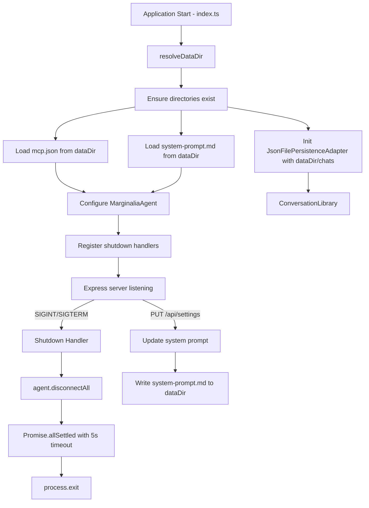

# Design Document: App Config Improvements

## Overview

This design covers three related improvements to Marginalia's application lifecycle and configuration management:

1. **Graceful MCP server shutdown** — Register process signal handlers (SIGINT, SIGTERM) that disconnect all active MCP clients before exit, with a 5-second timeout to prevent orphaned child processes.
2. **Configurable persistent system prompt** — Load/save the system prompt from a `system-prompt.md` file in the config directory, so customisations survive restarts.
3. **Relocate data/config to `~/.config/marginalia/`** — Move conversations and config files out of the project's `./data/` directory into a platform-appropriate location (`~/.config/marginalia/` on Linux/macOS, `%APPDATA%/marginalia/` on Windows), overridable via `MARGINALIA_DATA_DIR`.

All three changes share a common dependency: a centralised `resolveDataDir()` function that determines the base data directory. The shutdown and system prompt features build on top of existing classes (`MarginaliaAgent`, `McpConfigManager`, routes) with minimal new surface area.

## Architecture

### High-Level Flow



### Module Responsibilities

| Module | Change |
|---|---|
| `src/data-dir.ts` (new) | Exports `resolveDataDir()` — single source of truth for the base data directory path |
| `src/agent.ts` | Add `disconnectAll(): Promise<PromiseSettledResult<void>[]>` to `MarginaliaAgent` |
| `src/system-prompt.ts` (new) | `loadSystemPrompt(dataDir)` and `saveSystemPrompt(dataDir, content)` — file I/O for `system-prompt.md` |
| `src/index.ts` | Wire `resolveDataDir()`, pass paths to constructors, register shutdown handlers, load system prompt on startup |
| `src/routes.ts` | Persist system prompt on `PUT /api/settings` when `systemPrompt` changes |
| `src/mcp-config-manager.ts` | No structural change — already accepts `filePath` in constructor |
| `src/persistence-adapter.ts` | No structural change — already accepts `dataDir` in constructor |

## Components and Interfaces

### 1. `resolveDataDir()` — `src/data-dir.ts`

A pure function that determines the base data directory:

```typescript
import * as path from "node:path";
import * as os from "node:os";

/**
 * Resolve the base data directory for Marginalia.
 *
 * Priority:
 * 1. MARGINALIA_DATA_DIR env var (absolute or relative to cwd)
 * 2. Platform default: ~/.config/marginalia/ (Linux/macOS) or %APPDATA%/marginalia/ (Windows)
 */
export function resolveDataDir(): string {
  const envDir = process.env.MARGINALIA_DATA_DIR;
  if (envDir) {
    return path.resolve(envDir);
  }
  const platform = process.platform;
  if (platform === "win32") {
    const appData = process.env.APPDATA ?? path.join(os.homedir(), "AppData", "Roaming");
    return path.join(appData, "marginalia");
  }
  return path.join(os.homedir(), ".config", "marginalia");
}
```

Key decisions:
- `path.resolve()` handles both absolute and relative `MARGINALIA_DATA_DIR` values (relative resolves against `cwd`).
- Windows falls back to `~/AppData/Roaming` if `%APPDATA%` is unset (defensive).
- No I/O — directory creation is the caller's responsibility.

### 2. `MarginaliaAgent.disconnectAll()` — `src/agent.ts`

New public method on the existing class:

```typescript
/**
 * Disconnect all active MCP clients.
 * Returns a settled promise array so callers can inspect individual results.
 */
async disconnectAll(): Promise<PromiseSettledResult<void>[]> {
  const results = await Promise.allSettled(
    this.mcpClients.map(client => client.disconnect())
  );
  this.mcpClients = [];
  return results;
}
```

This reuses the same `client.disconnect()` call already present in `configureMcp()`. The method clears the client list after settling so the agent is left in a clean state.

### 3. Shutdown Handler — `src/index.ts`

Registered after the server starts listening:

```typescript
function registerShutdownHandlers(agent: MarginaliaAgent): void {
  let shuttingDown = false;

  const handler = async (signal: string) => {
    if (shuttingDown) return; // prevent double-fire
    shuttingDown = true;
    console.log(`\n[shutdown] Received ${signal}, disconnecting MCP servers...`);

    const timeout = new Promise<void>(resolve => setTimeout(resolve, 5000));
    const disconnect = agent.disconnectAll().then(results => {
      const failed = results.filter(r => r.status === "rejected");
      if (failed.length > 0) {
        console.warn(`[shutdown] ${failed.length} MCP disconnect(s) failed`);
      }
    });

    await Promise.race([disconnect, timeout]);
    process.exit(0);
  };

  process.on("SIGINT", () => { handler("SIGINT"); });
  process.on("SIGTERM", () => { handler("SIGTERM"); });
}
```

Design rationale:
- `Promise.race` with a 5-second timeout ensures the process exits even if a client hangs.
- `shuttingDown` flag prevents double-fire (e.g. Ctrl+C pressed twice).
- Individual disconnect failures are logged but don't block other disconnects (handled by `Promise.allSettled` inside `disconnectAll`).

### 4. System Prompt Persistence — `src/system-prompt.ts`

```typescript
import * as fs from "node:fs/promises";
import * as path from "node:path";

const FILENAME = "system-prompt.md";

/**
 * Load the system prompt from disk. Returns null if the file doesn't exist.
 */
export async function loadSystemPrompt(dataDir: string): Promise<string | null> {
  try {
    const content = await fs.readFile(path.join(dataDir, FILENAME), "utf-8");
    const trimmed = content.trim();
    return trimmed.length > 0 ? trimmed : null;
  } catch (err: unknown) {
    const e = err as NodeJS.ErrnoException;
    if (e.code === "ENOENT") return null;
    console.warn(`[system-prompt] Failed to read ${FILENAME}: ${e.message}`);
    return null;
  }
}

/**
 * Save the system prompt to disk. If content is empty, deletes the file.
 */
export async function saveSystemPrompt(dataDir: string, content: string): Promise<void> {
  const filePath = path.join(dataDir, FILENAME);
  if (content.trim().length === 0) {
    try {
      await fs.unlink(filePath);
    } catch (err: unknown) {
      const e = err as NodeJS.ErrnoException;
      if (e.code !== "ENOENT") {
        console.error(`[system-prompt] Failed to delete ${FILENAME}: ${e.message}`);
      }
    }
    return;
  }
  try {
    await fs.writeFile(filePath, content, "utf-8");
  } catch (err: unknown) {
    const e = err as Error;
    console.error(`[system-prompt] Failed to write ${FILENAME}: ${e.message}`);
  }
}
```

### 5. Route Changes — `src/routes.ts`

The `PUT /api/settings` handler gains system prompt persistence. The `RouterDeps` interface adds `dataDir: string`:

```typescript
// Inside PUT /api/settings handler, after updating config.systemPrompt:
if (systemPrompt !== undefined && systemPrompt !== oldPrompt) {
  agent.updateSystemPrompt(systemPrompt);
  saveSystemPrompt(dataDir, systemPrompt).catch(err =>
    console.error("[routes] system prompt save failed:", err)
  );
}
```

### 6. Startup Wiring — `src/index.ts`

```typescript
const dataDir = resolveDataDir();
await fs.mkdir(path.join(dataDir, "chats"), { recursive: true });

const adapter = new JsonFilePersistenceAdapter(path.join(dataDir, "chats"));
const mcpConfigManager = new McpConfigManager(path.join(dataDir, "mcp.json"));

// Load persistent system prompt (falls back to default)
const persistedPrompt = await loadSystemPrompt(dataDir);
if (persistedPrompt) {
  config.systemPrompt = persistedPrompt;
}
```

## Data Models

No new domain types are introduced. The changes affect how existing types are initialised and where their backing files live.

### Directory Layout (after migration)

```
~/.config/marginalia/           # resolveDataDir() default
├── chats/                      # conversation JSON files
│   ├── {uuid}.json
│   └── ...
├── mcp.json                    # MCP server configurations
└── system-prompt.md            # user's custom system prompt (optional)
```

### Environment Variable

| Variable | Default | Description |
|---|---|---|
| `MARGINALIA_DATA_DIR` | `~/.config/marginalia/` (Linux/macOS), `%APPDATA%/marginalia/` (Windows) | Override base data directory. Relative paths resolve against cwd. |

### Constructor Parameter Changes

| Class | Current Default | New Default |
|---|---|---|
| `JsonFilePersistenceAdapter` | `"./data/conversations"` | `resolveDataDir() + "/chats"` |
| `McpConfigManager` | `"./data/mcp.json"` | `resolveDataDir() + "/mcp.json"` |

Both classes already accept the path as a constructor parameter, so no signature changes are needed — only the values passed from `index.ts` change.


## Correctness Properties

*A property is a characteristic or behavior that should hold true across all valid executions of a system — essentially, a formal statement about what the system should do. Properties serve as the bridge between human-readable specifications and machine-verifiable correctness guarantees.*

### Property 1: disconnectAll settles all clients

*For any* list of MCP clients (where each client's `disconnect()` may resolve or reject independently), calling `disconnectAll()` SHALL attempt `disconnect()` on every client in the list and return a `PromiseSettledResult` array of the same length, with no client skipped regardless of other clients' failures.

**Validates: Requirements 1.1, 1.3**

### Property 2: System prompt save/load round-trip

*For any* non-empty string (after trimming), saving it via `saveSystemPrompt(dataDir, content)` and then loading it via `loadSystemPrompt(dataDir)` SHALL return a string equal to `content.trim()`.

**Validates: Requirements 2.1, 2.3, 2.6**

### Property 3: resolveDataDir respects MARGINALIA_DATA_DIR

*For any* non-empty string value assigned to the `MARGINALIA_DATA_DIR` environment variable, `resolveDataDir()` SHALL return `path.resolve(value)` — meaning absolute paths are returned as-is and relative paths are resolved against the current working directory.

**Validates: Requirements 3.1, 3.8**

## Error Handling

### Shutdown Errors

- Individual `McpClient.disconnect()` failures are captured by `Promise.allSettled` — they are logged but do not prevent other clients from disconnecting.
- If all disconnects hang, the 5-second `Promise.race` timeout ensures the process exits regardless.
- The `shuttingDown` flag prevents double-fire from rapid repeated signals.

### System Prompt I/O Errors

- `loadSystemPrompt`: Returns `null` on `ENOENT` (file not found) — the caller falls back to the built-in default. Other read errors are logged and also return `null`.
- `saveSystemPrompt`: Write failures are logged via `console.error` but do not throw — the in-memory prompt value remains active. Delete failures on `ENOENT` are silently ignored (file already gone).

### Directory Creation Errors

- `fs.mkdir(dataDir, { recursive: true })` is called at startup. If it fails (e.g. permissions), the error propagates and prevents the server from starting — this is intentional, since the app cannot function without its data directory.

### Existing Error Patterns Preserved

- `McpConfigManager.load()` already handles `ENOENT` gracefully (returns `[]`).
- `JsonFilePersistenceAdapter` already handles `ENOENT` in `listSummaries()` (returns `[]`).
- No changes to existing error handling in these classes.

## Testing Strategy

### Property-Based Tests (fast-check)

Each correctness property maps to a single property-based test with a minimum of 100 iterations. Tests are tagged with the property they validate.

| Property | Test Description | Generator Strategy |
|---|---|---|
| Property 1 | Create N mock MCP clients with random resolve/reject behavior, call `disconnectAll()`, assert result length equals N and all clients had `disconnect()` called | `fc.array(fc.boolean())` to determine which clients fail |
| Property 2 | Generate random non-empty strings (with arbitrary whitespace padding), save then load, assert equality with trimmed input | `fc.string()` filtered to non-empty-after-trim, wrapped with `fc.tuple(fc.string(), fc.string())` for leading/trailing whitespace |
| Property 3 | Generate random path strings, set `MARGINALIA_DATA_DIR`, call `resolveDataDir()`, assert result equals `path.resolve(input)` | `fc.oneof(fc.string(), fc.constant("/absolute/path"), fc.constant("relative/path"))` |

### Unit Tests (Vitest)

Unit tests cover specific examples, edge cases, and integration points:

- **disconnectAll with empty client list** — resolves immediately with `[]` (edge case from 1.4)
- **Shutdown timeout** — mock a hanging disconnect, verify the race resolves within timeout (example from 1.2)
- **loadSystemPrompt with missing file** — returns `null` (edge case from 2.2)
- **saveSystemPrompt with empty string** — deletes the file, subsequent load returns `null` (example from 2.4)
- **saveSystemPrompt with write failure** — does not throw, logs error (example from 2.5)
- **resolveDataDir platform defaults** — returns `~/.config/marginalia/` on Linux/macOS when env var is unset
- **Directory creation on startup** — directories are created when they don't exist (example from 3.5)

### Test Configuration

- **Library**: fast-check (already in devDependencies)
- **Runner**: Vitest with `--run` flag
- **Iterations**: Minimum 100 per property test
- **Tag format**: `Feature: app-config-improvements, Property {N}: {title}`
- Each correctness property is implemented by a single property-based test
- Tests live in `src/__tests__/` following existing naming conventions

### Test File Organization

| File | Contents |
|---|---|
| `src/__tests__/data-dir.test.ts` | Property 3 + unit tests for `resolveDataDir()` |
| `src/__tests__/system-prompt.test.ts` | Property 2 + unit tests for load/save |
| `src/__tests__/agent-disconnect.test.ts` | Property 1 + unit tests for `disconnectAll()` edge cases |
