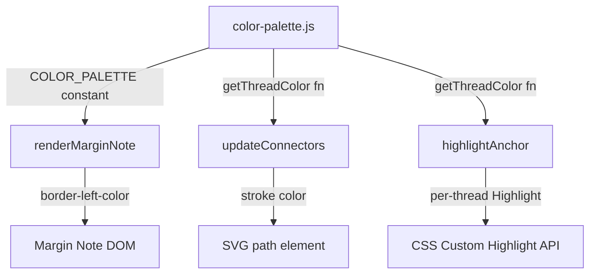

# Design Document: Colored Side Threads

## Overview

This feature adds color-coded visual differentiation to side threads in Marginalia. Each side thread is assigned a color from a fixed 32-color palette based on its index in the `sideThreads` array. The assigned color is applied consistently to three visual elements: the margin note's left border, the SVG connector line, and the anchor text highlight in the main panel.

The implementation is entirely frontend — no backend or data model changes are required. The color palette is a constant array, and color assignment is a pure function of array index (`index % 32`). This keeps the feature stateless and deterministic: the same conversation always produces the same color mapping.

## Architecture

The feature introduces a single new module (`color-palette.js`) and modifies three existing rendering paths in `app.js`:



### Design Decisions

1. **Separate module for palette**: The 32-color array and the `getThreadColor(index)` helper live in `frontend/color-palette.js`. This keeps the palette testable as a pure function without DOM dependencies, mirroring the pattern used by `connector-math.js`.

2. **Index-based assignment, not ID-based**: Color is derived from the side thread's position in `state.conversation.sideThreads`, not from the thread's UUID. This means colors are deterministic from the array order and don't require any persistence changes.

3. **Per-thread CSS Highlights**: The current implementation uses a single shared `Highlight` named `"marginalia-anchors"` with a uniform yellow background. To support per-thread colors, each side thread gets its own named `Highlight` (e.g., `"marginalia-anchor-0"`, `"marginalia-anchor-1"`, etc.) with a corresponding `::highlight()` CSS rule using a semi-transparent version of the thread's color. A `<style>` element is dynamically managed to inject these rules.

4. **No backend changes**: The color is a pure view concern derived from array position. No new fields are added to the `SideThread` model or persisted data.

## Components and Interfaces

### New Module: `frontend/color-palette.js`

```js
/**
 * Fixed palette of 32 visually distinct CSS color strings.
 * @type {string[]}
 */
const COLOR_PALETTE = [ /* 32 hex colors */ ];

/**
 * Get the color for a side thread given its zero-based index.
 * @param {number} index — zero-based position in sideThreads array
 * @returns {string} CSS color string from COLOR_PALETTE
 */
function getThreadColor(index) {
  return COLOR_PALETTE[index % 32];
}
```

Exported via the same `if (typeof exports !== 'undefined')` pattern used by `connector-math.js`, so it works both as a browser global (loaded via `<script>`) and as a CommonJS import in Vitest tests.

### Modified: `renderMarginNote()` in `app.js`

Accepts a new `colorIndex` parameter. Applies `border-left: 3px solid <color>` to the `.margin-note` element.

### Modified: `updateConnectors()` in `app.js`

When creating or updating SVG `<path>` elements, sets the `stroke` attribute to the thread's color instead of relying on the CSS rule `stroke: var(--color-primary)`. The existing `stroke-width`, `stroke-dasharray`, and `opacity` remain unchanged.

### Modified: `highlightAnchor()` in `app.js`

Accepts a `colorIndex` parameter. Instead of pushing all ranges into a single shared `Highlight`, creates a per-thread named highlight (e.g., `"marginalia-anchor-0"`) and injects a corresponding `::highlight(marginalia-anchor-N)` CSS rule with `background-color: rgba(r, g, b, 0.25)`.

### Modified: `index.html`

- Adds `<script src="color-palette.js"></script>` before `app.js`.
- Removes or keeps the existing `::highlight(marginalia-anchors)` rule as a fallback for browsers without per-thread highlight support.

## Data Models

No changes to backend data models. The `SideThread` interface in `src/models.ts` remains unchanged — no `colorIndex` field is persisted.

The color is a derived view property:

```
colorIndex = sideThreads.indexOf(thread) % 32
```

This derivation happens at render time in the frontend. On conversation load, the same derivation reproduces the same colors because `sideThreads` array order is preserved by the JSON persistence layer.

## Correctness Properties

*A property is a characteristic or behavior that should hold true across all valid executions of a system — essentially, a formal statement about what the system should do. Properties serve as the bridge between human-readable specifications and machine-verifiable correctness guarantees.*

### Property 1: Color assignment is index modulo palette size

*For any* non-negative integer index, `getThreadColor(index)` should return `COLOR_PALETTE[index % 32]`. This must hold for indices within the palette range (0–31), at the wrapping boundary (32, 33, …), and for arbitrarily large indices.

**Validates: Requirements 2.1, 2.2, 2.3, 7.1, 7.2**

### Property 2: Appending a thread preserves existing color assignments

*For any* array of N side threads (N ≥ 0) and any new thread appended to the array, the color assigned to every previously existing thread (at indices 0 through N−1) must remain unchanged after the append.

**Validates: Requirements 6.1**

### Property 3: Hex-to-rgba conversion preserves RGB components

*For any* valid 6-digit hex color string (e.g., `#a1b2c3`) and any alpha value in [0, 1], the `hexToRgba(hex, alpha)` function should produce an `rgba(r, g, b, a)` string where the r, g, b components match the parsed hex values and the alpha matches the input alpha.

**Validates: Requirements 5.1**

## Error Handling

This feature is entirely frontend and non-critical — errors should never block the user from interacting with the conversation.

| Scenario | Handling |
|---|---|
| `COLOR_PALETTE` accessed with negative index | `getThreadColor` uses modulo which handles this; palette returns a valid color for any integer input via `((index % 32) + 32) % 32` to handle negative values safely |
| CSS Custom Highlight API not supported | `highlightAnchor` already checks `typeof CSS !== "undefined" && CSS.highlights` — per-thread highlights follow the same guard. Fallback: no colored highlights, margin note borders and connector lines still show color |
| Dynamic `<style>` injection fails | Wrap in try/catch; degrade to default yellow highlight. Margin note borders and connector colors are unaffected |
| `sideThreads` array is empty | `getThreadColor` is never called; no colors applied. No error |
| Thread index exceeds 32 | Modulo wrapping handles this by design (Requirement 7) |

## Testing Strategy

### Property-Based Tests (fast-check)

Each correctness property maps to a single property-based test with a minimum of 100 iterations. Tests live in `src/__tests__/color-palette.test.ts` and import the pure functions from a mirrored TypeScript re-implementation of `frontend/color-palette.js` (same pattern as `connector-math.test.ts`).

| Test | Property | Tag |
|---|---|---|
| Color index equals palette lookup at index mod 32 | Property 1 | `Feature: colored-side-threads, Property 1: Color assignment is index modulo palette size` |
| Appending to thread array doesn't change existing colors | Property 2 | `Feature: colored-side-threads, Property 2: Appending a thread preserves existing color assignments` |
| Hex-to-rgba produces correct RGB components and alpha | Property 3 | `Feature: colored-side-threads, Property 3: Hex-to-rgba conversion preserves RGB components` |

### Unit Tests

Unit tests cover specific examples and edge cases that complement the property tests:

- **Palette structure**: `COLOR_PALETTE` has exactly 32 entries, each is a valid 7-character hex string (`#rrggbb`)
- **Boundary examples**: `getThreadColor(0)` returns first color, `getThreadColor(31)` returns last, `getThreadColor(32)` wraps to first
- **hexToRgba specific values**: `hexToRgba("#ff0000", 0.25)` → `"rgba(255, 0, 0, 0.25)"`
- **Edge case — black and white**: `hexToRgba("#000000", 0.5)` and `hexToRgba("#ffffff", 0.5)` produce correct output

### Testing Library

- **Property-based testing**: `fast-check` (already in devDependencies)
- **Test runner**: Vitest (already configured)
- **Minimum iterations**: 100 per property test (`{ numRuns: 100 }`)
- Each property test must include a comment referencing its design document property

