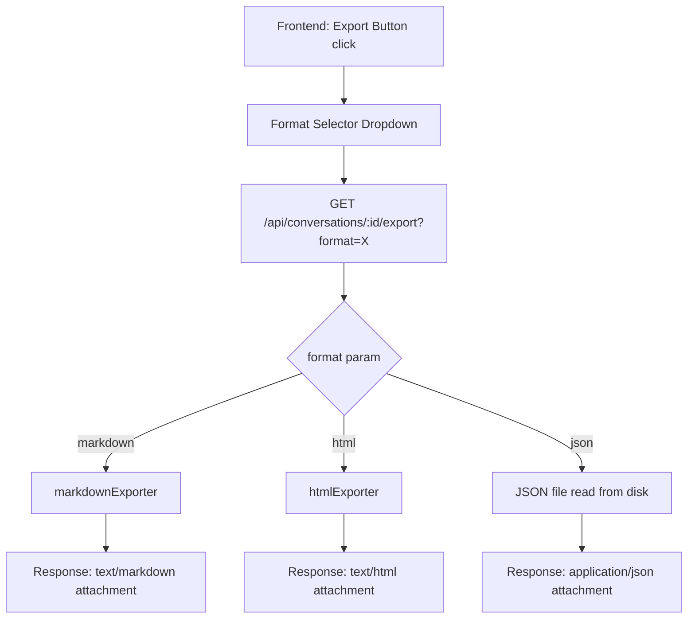
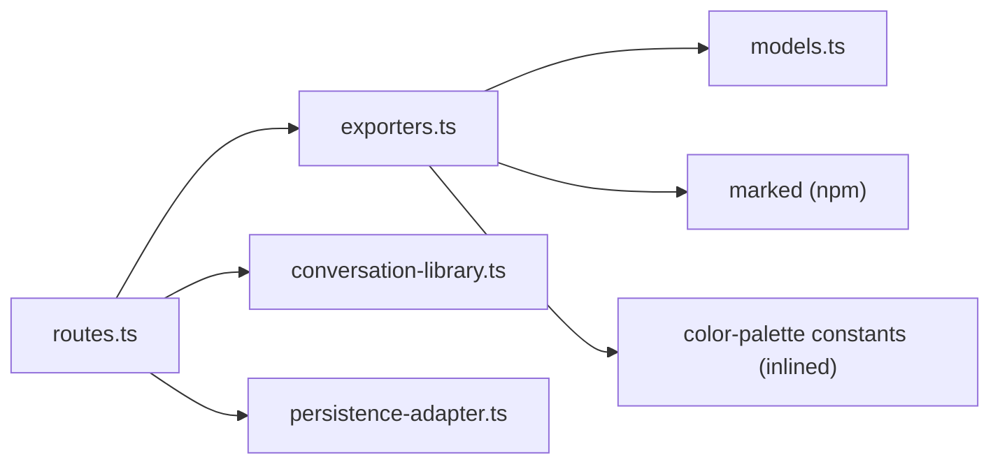

# Design Document: Conversation Export

## Overview

This feature adds the ability to export Marginalia conversations in three formats — Markdown, HTML, and JSON — via a single backend endpoint (`GET /api/conversations/:id/export?format=...`) and a frontend export button with format selector dropdown.

The design follows the existing architecture: a new route handler in `routes.ts` delegates to format-specific exporter functions. The JSON exporter serves the persisted file directly from disk. The Markdown and HTML exporters transform the in-memory `Conversation` model into their respective output formats. The HTML exporter uses `marked` server-side for Markdown-to-HTML conversion and inlines all CSS to produce a standalone document.

Key design decisions:
- **Exporters are pure functions** — each takes a `Conversation` and returns a string, making them trivially testable without HTTP or filesystem dependencies.
- **JSON export is zero-transformation** — it reads the persisted `.json` file from disk and streams it directly, guaranteeing byte-level compatibility with the storage format.
- **HTML export inlines everything** — no external dependencies, no scripts, just a self-contained read-only document with the two-column layout and color-coded anchor highlights.
- **`marked` is already a devDependency** — it's used on the frontend via CDN; the server-side import avoids adding new dependencies.

## Architecture

The export feature integrates into the existing request flow:



The route handler in `routes.ts`:
1. Validates the `format` query parameter (400 if invalid/missing)
2. Loads the conversation via `library.load(id)` (404 if not found)
3. Sanitises the title for the filename
4. Dispatches to the appropriate exporter
5. Sets `Content-Type` and `Content-Disposition` headers
6. Returns the exported content

For JSON, step 2 is replaced by reading the raw file from `{dataDir}/chats/{id}.json` via `fs.readFile`, with an existence check via `library.exists(id)`.

## Components and Interfaces

### New Files

**`src/exporters.ts`** — Pure exporter functions, no side effects.

```typescript
// Sanitise a conversation title for use in filenames
export function sanitiseTitle(title: string): string;

// Render a Conversation as a Markdown string
export function exportMarkdown(conversation: Conversation): string;

// Render a Conversation as a self-contained HTML string
export function exportHtml(conversation: Conversation): string;
```

### Modified Files

**`src/routes.ts`** — Add `GET /api/conversations/:id/export` route handler inside `createRouter()`. Uses the existing `library` and `dataDir` from `RouterDeps`.

**`frontend/app.js`** — Add export button + format selector dropdown logic. The button appears in `#input-bar` between the settings gear and the ask button, visible only when a conversation with messages is loaded.

**`frontend/index.html`** — Add the export button element and dropdown markup to the `#input-bar` section. Add CSS for the export button and dropdown.

### Interfaces

```typescript
// No new interfaces needed — exporters are plain functions
// that accept the existing Conversation type from models.ts

// Route handler signature (inside createRouter):
// GET /api/conversations/:id/export?format=markdown|html|json

// Query parameter:
//   format: "markdown" | "html" | "json"

// Response headers per format:
//   Content-Type: text/markdown | text/html | application/json (all with charset=utf-8)
//   Content-Disposition: attachment; filename="{sanitisedTitle}.{ext}"
```

### Dependency Flow



The color palette constants from `frontend/color-palette.js` will be duplicated as a TypeScript constant array in `exporters.ts`. This avoids runtime dependency on the frontend file and keeps the exporter pure. The palette is a static 32-element array that changes extremely rarely.

## Data Models

No new data models are introduced. The feature operates on the existing types from `models.ts`:

- **`Conversation`** — the root object with `id`, `title`, `mainThread`, `sideThreads`, `createdAt`, `updatedAt`
- **`Message`** — `id`, `role`, `content`, `toolInvocations`, `timestamp`
- **`SideThread`** — `id`, `anchor` (with `messageId`, `startOffset`, `endOffset`, `selectedText`), `messages`, `collapsed`
- **`AnchorPosition`** — `messageId`, `startOffset`, `endOffset`, `selectedText`

The JSON export format is identical to the `SerialisedConversation` shape written by `JsonFilePersistenceAdapter.save()` — dates as ISO 8601 strings, all fields preserved.

The sanitised filename is derived from `Conversation.title` by:
1. Replacing characters not matching `[a-zA-Z0-9 _-]` with underscores
2. Trimming to a maximum of 100 characters


## Correctness Properties

*A property is a characteristic or behavior that should hold true across all valid executions of a system — essentially, a formal statement about what the system should do. Properties serve as the bridge between human-readable specifications and machine-verifiable correctness guarantees.*

### Property 1: Title sanitisation invariant

*For any* string used as a conversation title, the sanitised filename output shall contain only characters matching `[a-zA-Z0-9 _-]` and shall have length at most 100 characters.

**Validates: Requirements 1.7**

### Property 2: Format-to-header mapping

*For any* valid format value in `{"markdown", "html", "json"}` and any conversation, the export response shall set the correct `Content-Type` (`text/markdown`, `text/html`, or `application/json`, all with `charset=utf-8`) and a `Content-Disposition` header of `attachment; filename="{sanitisedTitle}.{ext}"` where `ext` matches the format.

**Validates: Requirements 1.4, 1.5, 1.6**

### Property 3: Invalid format rejection

*For any* string that is not one of `"markdown"`, `"html"`, or `"json"` (including empty/missing), the export endpoint shall return HTTP 400.

**Validates: Requirements 1.2**

### Property 4: Markdown title heading

*For any* conversation, the Markdown export output shall start with `# {title}` as a level-1 heading on the first line.

**Validates: Requirements 2.1**

### Property 5: Markdown message content preservation

*For any* conversation with messages, every user message's content shall appear in the Markdown output preceded by a `## Question` heading, and every assistant message's content shall appear verbatim (unmodified) in the output.

**Validates: Requirements 2.2, 2.3**

### Property 6: Markdown side thread blockquote structure

*For any* conversation with side threads, each side thread shall be rendered as a blockquote prefixed with `> **On: "{selectedText}"**`, with user exchanges prefixed by `> **Q:**` and assistant exchanges prefixed by `> **A:**`, and with blank lines before and after the blockquote block.

**Validates: Requirements 2.5, 2.6, 7.4**

### Property 7: Markdown side thread placement order

*For any* conversation with multiple side threads anchored to the same assistant message, the blockquotes shall appear in the same order as the threads appear in the `sideThreads` array, and each blockquote shall appear after the paragraph containing the anchor's `selectedText`.

**Validates: Requirements 2.4, 7.1, 7.3**

### Property 8: HTML standalone structure

*For any* conversation, the HTML export shall be a valid HTML5 document containing `<!DOCTYPE html>`, a `<meta charset="UTF-8">` declaration, a `<title>` element matching the conversation title, a `<style>` element with inlined CSS, no external resource URLs (no `http://` or `https://` in `src` or `href` attributes), and no interactive UI elements (`<input>`, `<textarea>`, `<nav>`, `<dialog>`).

**Validates: Requirements 3.1, 3.2, 3.4, 3.9**

### Property 9: HTML markdown-to-HTML conversion

*For any* conversation with assistant messages containing Markdown formatting (e.g., `**bold**`, `# heading`, `` `code` ``), the HTML export shall contain the corresponding HTML elements (`<strong>`, `<h1>`, `<code>`) rather than raw Markdown syntax.

**Validates: Requirements 3.5**

### Property 10: HTML side thread content presence

*For any* conversation with side threads, the HTML export shall contain the `selectedText`, the first user question, and the first assistant response for each side thread.

**Validates: Requirements 3.6**

### Property 11: HTML anchor color highlighting

*For any* conversation with N side threads (N ≥ 1), the HTML export shall contain a `<mark>` element for each anchor, styled with a background color derived from `COLOR_PALETTE[threadIndex % 32]` at approximately 0.25 alpha opacity. When multiple side threads anchor to the same message, each shall have a distinct color highlight.

**Validates: Requirements 3.7, 3.8, 6.1, 6.2, 6.3, 6.5**

### Property 12: JSON export round-trip

*For any* valid `Conversation` object, saving it via `JsonFilePersistenceAdapter`, then reading the raw file (simulating JSON export), then loading it back via `JsonFilePersistenceAdapter.load()` shall produce a conversation with equivalent `id`, `title`, `mainThread`, `sideThreads`, `createdAt`, and `updatedAt` values.

**Validates: Requirements 4.1, 4.2, 4.3, 4.4**

## Error Handling

The export feature follows the existing typed error boundary pattern:

| Scenario | HTTP Status | Response Body | Source |
|---|---|---|---|
| Missing or invalid `format` query param | 400 | `{ "error": "Invalid or missing format. Supported formats: markdown, html, json" }` | Route handler validation |
| Conversation ID not found | 404 | `{ "error": "Conversation not found" }` | `LibraryError` with code `NOT_FOUND` |
| JSON file missing on disk (race condition) | 404 | `{ "error": "Conversation not found" }` | `fs.readFile` ENOENT → mapped to 404 |
| Internal error during export | 500 | `{ "error": "Export failed" }` | Catch-all in route handler |

Error handling strategy:
- **Format validation** happens first, before any I/O, returning 400 immediately for invalid formats.
- **Conversation lookup** uses the existing `library.load()` / `library.exists()` which throws `LibraryError` with `NOT_FOUND` code — the route handler catches this and returns 404, matching the existing pattern in `GET /api/conversations/:id`.
- **JSON export race condition**: Since JSON export reads the raw file from disk, there's a TOCTOU window between `library.exists(id)` and `fs.readFile()`. If the file disappears between checks, the `ENOENT` error is caught and mapped to 404.
- **Exporter errors** (e.g., `marked` throwing on malformed input) are caught by a top-level try/catch and returned as 500.

## Testing Strategy

### Property-Based Testing

Property-based tests use **fast-check** (already a devDependency) with a minimum of 100 iterations per property. Each test references its design document property via a tag comment.

The exporters are pure functions (`Conversation → string`), making them ideal for property-based testing. Generators will produce random `Conversation` objects with varying numbers of messages, side threads, anchor positions, and markdown content.

Shared generators (already partially defined in `conversation-library.test.ts`) will be extracted or duplicated for reuse:
- `arbConversation` — random conversation with messages and side threads
- `arbMessage` — random message with role, content, timestamp
- `arbSideThread` — random side thread with anchor and messages

Properties to implement as PBT:
- **Property 1** (title sanitisation) — generate random Unicode strings, verify output matches `[a-zA-Z0-9 _-]` and length ≤ 100
- **Property 3** (invalid format rejection) — generate random strings not in the valid set
- **Property 4** (markdown title) — generate random conversations, verify first line
- **Property 5** (markdown content preservation) — generate conversations with messages, verify content appears
- **Property 6** (blockquote structure) — generate conversations with side threads, verify blockquote format
- **Property 8** (HTML standalone) — generate conversations, verify structural invariants
- **Property 9** (HTML markdown conversion) — generate conversations with markdown content, verify HTML output
- **Property 10** (HTML side thread content) — generate conversations with side threads, verify content presence
- **Property 11** (HTML anchor colors) — generate conversations with side threads, verify color assignment
- **Property 12** (JSON round-trip) — generate conversations, save/read/load, verify equivalence

Tag format: `Feature: conversation-export, Property {N}: {title}`

Each correctness property shall be implemented by a single property-based test.

### Unit Tests

Unit tests complement PBTs for specific examples and edge cases:
- Empty conversation export (all three formats) — edge cases from 2.7, 3.10
- Conversation with title containing special characters (emoji, slashes, etc.)
- Side thread with `selectedText` not found in message content (fallback behavior from 7.2)
- Anchor offset resolution failure with text-search fallback (6.4)
- HTTP 400 for missing format parameter (1.2 example)
- HTTP 404 for non-existent conversation (1.3 example)

### Test File

All export tests live in `src/__tests__/exporters.test.ts`, following the project convention.

### PBT Library

**fast-check** v4.x (already installed) — configured with `{ numRuns: 100 }` per property test.
