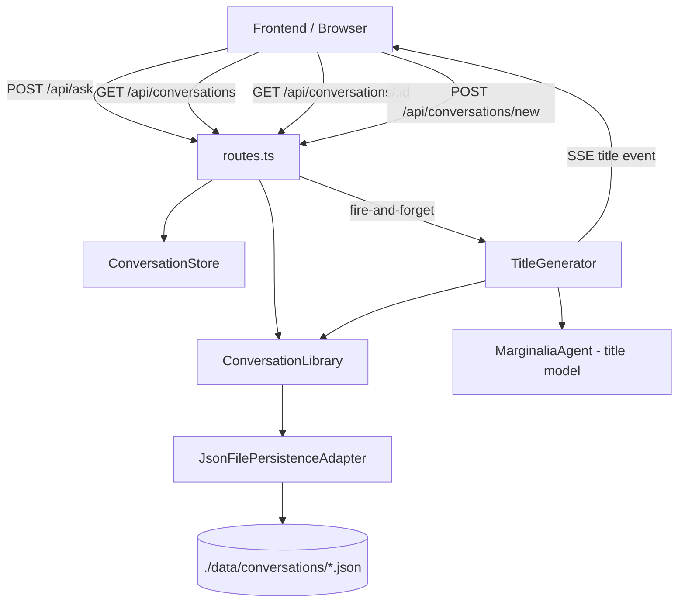

# Design Document: Conversation Saving

## Overview

Conversation saving adds a persistence layer to Marginalia so that conversations survive page refreshes and server restarts. The design introduces three new modules — a `PersistenceAdapter` for JSON file I/O, a `ConversationLibrary` that wraps the adapter with higher-level CRUD operations, and a `TitleGenerator` that asynchronously produces short titles via a dedicated cheap Bedrock model. Existing modules (`ConversationStore`, `routes.ts`, `models.ts`) are extended minimally to integrate persistence without breaking their current contracts.

The storage backend is JSON files, one per conversation, under `./data/conversations/`. The `PersistenceAdapter` interface is kept thin so SQLite can be swapped in later without touching the library or routes.

## Architecture



Key flows:

1. **First message** — `routes.ts` calls `library.save(conversation)` before streaming starts, then fires `titleGenerator.generateAsync(...)` without awaiting it.
2. **Subsequent messages** — after each assistant message is stored in `ConversationStore`, `routes.ts` calls `library.save(conversation)` (debounced / immediate, within 5 s).
3. **List** — `GET /api/conversations` reads summaries from `library.list()`.
4. **Load** — `GET /api/conversations/:id` reads the full conversation, then `store.setConversation(loaded)` replaces the active one.
5. **New** — `POST /api/conversations/new` optionally deletes the empty current conversation, resets the store, persists the new empty conversation.

## Components and Interfaces

### PersistenceAdapter (interface)

```typescript
export interface PersistenceAdapter {
  save(conversation: Conversation): Promise<void>;
  load(id: string): Promise<Conversation>;
  delete(id: string): Promise<void>;
  listSummaries(): Promise<ConversationSummary[]>;
  exists(id: string): Promise<boolean>;
}
```

### JsonFilePersistenceAdapter

Implements `PersistenceAdapter`. Stores each conversation as `{dataDir}/{id}.json`.

- Constructor accepts `dataDir: string` (default `./data/conversations`).
- `ensureDir()` is called lazily on first write (and at startup via `ConversationLibrary.init()`).
- Serialises `Date` fields as ISO strings; deserialises them back to `Date` objects.
- Validates required fields on load; throws `PersistenceError` if invalid.

### ConversationLibrary

Thin orchestration layer over `PersistenceAdapter`. Injected into `createRouter`.

```typescript
export class ConversationLibrary {
  constructor(adapter: PersistenceAdapter) {}

  async save(conversation: Conversation): Promise<void>;
  async load(id: string): Promise<Conversation>;          // throws 404-style error if missing
  async delete(id: string): Promise<void>;
  async list(): Promise<ConversationSummary[]>;           // sorted by updatedAt desc
  async exists(id: string): Promise<boolean>;
  async init(): Promise<void>;                            // ensures data dir exists
}
```

Error handling: all methods catch adapter errors, log them, and re-throw a typed `LibraryError` so routes can distinguish 404 from 500.

### TitleGenerator

```typescript
export class TitleGenerator {
  constructor(titleModelId: string) {}

  // Fire-and-forget: resolves immediately, generates in background
  generateAsync(
    conversationId: string,
    firstQuestion: string,
    onComplete: (title: string) => Promise<void>
  ): void;
}
```

- Uses a separate `BedrockModel` instance with `titleModelId` (default `amazon.nova-micro-v1:0`, overridable via `TITLE_MODEL_ID` env var).
- Prompt instructs the model to return a plain string of ≤ 60 characters summarising the question.
- On success: calls `onComplete(title)` which saves to disk and updates the in-memory conversation.
- On failure: logs the error, does nothing else (conversation keeps `"Untitled Conversation"`).

### ConversationStore (extensions)

Two new methods added to the existing class:

```typescript
setConversation(conversation: Conversation): void;  // replaces active conversation (load flow)
```

`updatedAt` is bumped inside `addMainMessage` and `addSideMessage` after each mutation.

### models.ts (extensions)

`Conversation` gains two fields:

```typescript
title: string;      // default "Untitled Conversation"
updatedAt: Date;    // set to createdAt on creation, updated on each message add
```

`createConversation()` initialises both fields.

### routes.ts (extensions)

New endpoints added to `createRouter`:

| Method | Path | Description |
|--------|------|-------------|
| `GET` | `/api/conversations` | Returns `ConversationSummary[]` sorted by `updatedAt` desc |
| `GET` | `/api/conversations/:id` | Returns full `Conversation`; 404 if not found |
| `POST` | `/api/conversations/new` | Resets store, persists new conversation, returns `{ id }` |

Existing endpoints are extended to call `library.save()` after each assistant message is committed to the store.

The `title` SSE event is emitted on the existing SSE response connection when title generation completes. Since title generation is fire-and-forget and the SSE connection may already be closed, the `onComplete` callback checks whether the response is still writable before emitting.

### SSE: `title` event

```
event: title
data: { "conversation_id": "<id>", "title": "<generated title>" }
```

Emitted on the same SSE response object that was used for the `/api/ask` request that triggered title generation. If the connection is closed by the time generation completes, the event is silently dropped (title is still persisted to disk).

## Data Models

### Conversation (updated)

```typescript
export interface Conversation {
  id: string;
  title: string;          // NEW — default "Untitled Conversation"
  mainThread: Message[];
  sideThreads: SideThread[];
  createdAt: Date;
  updatedAt: Date;        // NEW — updated on every message mutation
}
```

### ConversationSummary (new)

```typescript
export interface ConversationSummary {
  id: string;
  title: string;
  createdAt: string;      // ISO 8601
  updatedAt: string;      // ISO 8601
  messageCount: number;   // total across mainThread + all sideThreads
}
```

`messageCount` is computed at list time by summing `mainThread.length + sum(sideThread.messages.length)`.

### Serialised JSON shape

```json
{
  "id": "uuid",
  "title": "Untitled Conversation",
  "mainThread": [
    {
      "id": "uuid",
      "role": "user",
      "content": "...",
      "toolInvocations": [],
      "timestamp": "2025-01-01T00:00:00.000Z"
    }
  ],
  "sideThreads": [],
  "createdAt": "2025-01-01T00:00:00.000Z",
  "updatedAt": "2025-01-01T00:00:00.000Z"
}
```

All `Date` fields are serialised as ISO 8601 strings and deserialised back to `Date` objects by `JsonFilePersistenceAdapter`.

### Validation on deserialisation

Required fields checked: `id` (string), `mainThread` (array), `sideThreads` (array), `createdAt` (parseable date string). Missing or malformed fields throw `PersistenceError` with a descriptive message.

## Correctness Properties

*A property is a characteristic or behavior that should hold true across all valid executions of a system — essentially, a formal statement about what the system should do. Properties serve as the bridge between human-readable specifications and machine-verifiable correctness guarantees.*

### Property 1: Conversation serialisation round-trip

*For any* valid `Conversation` object, serialising it to JSON and then deserialising it SHALL produce a structurally equivalent `Conversation` where all fields have the same values and all `Date` fields are `Date` instances (not strings).

**Validates: Requirements 7.1, 7.2**

---

### Property 2: Summary list is sorted by updatedAt descending

*For any* non-empty collection of persisted conversations, `library.list()` SHALL return summaries in descending `updatedAt` order — i.e., for every adjacent pair `[a, b]` in the result, `a.updatedAt >= b.updatedAt`.

**Validates: Requirements 2.2**

---

### Property 3: Summary messageCount matches conversation content

*For any* persisted `Conversation`, the `messageCount` in its `ConversationSummary` SHALL equal `mainThread.length + sum of each sideThread.messages.length`.

**Validates: Requirements 2.3**

---

### Property 4: Title length invariant

*For any* first user question string, the title produced by `TitleGenerator` SHALL be a non-empty string of at most 60 characters.

**Validates: Requirements 4.3**

---

### Property 5: New conversation title default

*For any* call to `createConversation()`, the returned `Conversation` SHALL have `title === "Untitled Conversation"` and `updatedAt` equal to `createdAt`.

**Validates: Requirements 5.2, 5.4**

---

### Property 6: updatedAt advances on message addition

*For any* `Conversation` and any message added to its main thread or any side thread, the `updatedAt` field of the conversation after the addition SHALL be greater than or equal to its value before the addition.

**Validates: Requirements 5.3**

---

### Property 7: Deserialisation validates required fields

*For any* JSON object missing one or more of the required fields (`id`, `mainThread`, `sideThreads`, `createdAt`), `JsonFilePersistenceAdapter.load()` SHALL throw a `PersistenceError` with a descriptive message rather than returning a partial object.

**Validates: Requirements 7.3**

---

## Error Handling

| Scenario | Behaviour |
|----------|-----------|
| Data directory missing at startup | `ConversationLibrary.init()` creates it recursively (`fs.mkdir` with `recursive: true`) |
| Write fails (disk full, permissions) | Error is logged; request continues; no crash |
| Load of non-existent ID | `LibraryError` with `code: "NOT_FOUND"` → routes return HTTP 404 |
| Deserialisation validation failure | `PersistenceError` thrown → routes return HTTP 500 with generic message |
| Title generation fails | Error logged; conversation retains `"Untitled Conversation"`; no retry |
| SSE connection closed before title ready | `title` event silently dropped; title still persisted to disk |

All errors from `PersistenceAdapter` are caught at the `ConversationLibrary` boundary and re-thrown as typed errors (`LibraryError` / `PersistenceError`) so routes can make clean HTTP status decisions without inspecting raw `fs` error codes.

## Testing Strategy

### Unit tests (Vitest)

- `JsonFilePersistenceAdapter`: save/load round-trip with a temp directory, missing-field validation, date deserialisation.
- `ConversationLibrary`: list sorting, messageCount computation, 404 propagation.
- `TitleGenerator`: mock Bedrock call, verify title truncation at 60 chars, verify error path leaves title unchanged.
- `models.ts`: `createConversation()` default field values.
- `ConversationStore`: `setConversation()` replaces active conversation.

### Property-based tests (Vitest + fast-check)

Each property test runs a minimum of 100 iterations.

- **Property 1** — `fc.record(...)` generates arbitrary `Conversation` objects; assert `deserialise(serialise(c))` is structurally equal and all Date fields are `instanceof Date`.
  - Tag: `Feature: conversation-saving, Property 1: serialisation round-trip`
- **Property 2** — `fc.array(fc.record(...))` generates collections of conversations with random `updatedAt` values; assert `list()` result is sorted descending.
  - Tag: `Feature: conversation-saving, Property 2: summary list sorted by updatedAt desc`
- **Property 3** — generate arbitrary conversations with random thread/message counts; assert `messageCount` in summary equals computed sum.
  - Tag: `Feature: conversation-saving, Property 3: messageCount matches content`
- **Property 4** — `fc.string()` generates arbitrary question strings; assert title length ≤ 60 and non-empty (using a mock that returns the raw model output).
  - Tag: `Feature: conversation-saving, Property 4: title length invariant`
- **Property 5** — assert `createConversation()` invariants (no generation needed, deterministic).
  - Tag: `Feature: conversation-saving, Property 5: new conversation defaults`
- **Property 6** — generate a conversation and a random message; assert `updatedAt` after addition ≥ `updatedAt` before.
  - Tag: `Feature: conversation-saving, Property 6: updatedAt advances on mutation`
- **Property 7** — `fc.record(...)` with arbitrary missing/wrong-typed fields; assert `load()` throws `PersistenceError`.
  - Tag: `Feature: conversation-saving, Property 7: deserialisation validates required fields`

Unit tests cover specific examples (empty conversation list → HTTP 200 `[]`, loading a non-existent ID → HTTP 404) and integration points (routes calling library, library calling adapter). Property tests handle the universal correctness guarantees.
