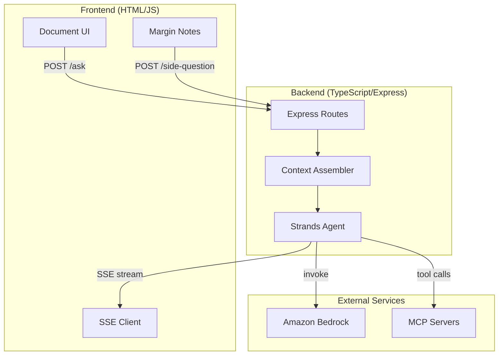
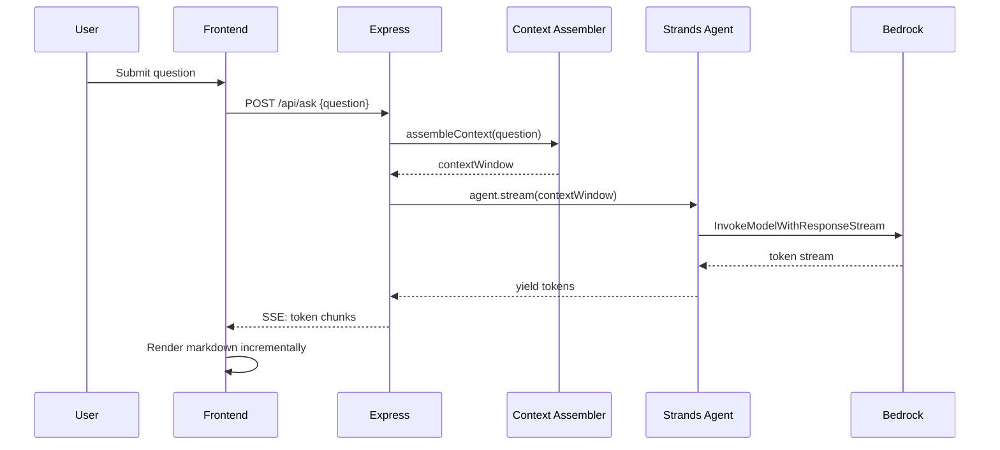
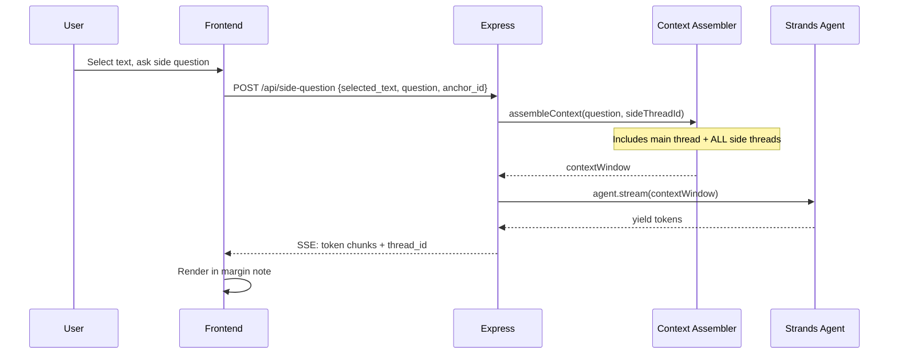
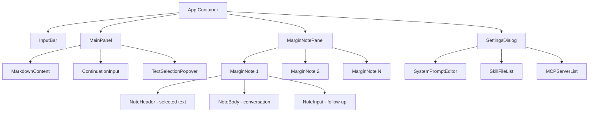

# Design Document: Marginalia

## Overview

Marginalia is a web-based LLM explainer tool that renders structured explanations as documents and supports inline margin notes for follow-up questions. The architecture follows a client-server model: a TypeScript backend powered by the Strands Agents SDK (`@strands-agents/sdk`) handles LLM orchestration, context assembly, and MCP tool integration via Amazon Bedrock, while a lightweight web frontend manages the document rendering, text selection, and margin note UI.

The core design challenge is context threading — assembling a coherent context window that includes the main explanation, all margin note exchanges with their anchor positions, and any new question, so the LLM always has full awareness of prior discussions.

### Key Design Decisions

1. **Strands Agents SDK (TypeScript)** for the backend agent — `@strands-agents/sdk` provides native MCP support, tool use orchestration, and streaming from Bedrock out of the box. This avoids reimplementing agent loop logic.
2. **Vanilla HTML/JS frontend** with targeted libraries — no React/Vue/build step. Uses marked.js for markdown rendering, CSS Custom Highlight API for text highlighting (no DOM mutations), tippy.js for the selection popover, and highlight.js for code blocks. Server-Sent Events (SSE) for streaming.
3. **Express** as the HTTP layer — simple, well-understood, pairs well with SSE and Node.js async patterns. Minimal setup for a weekend project.
4. **Server-side context assembly** — the backend owns the full conversation state and assembles the context window. The frontend sends lightweight requests (question + optional anchor info) and the backend handles threading.

### High-Level Architecture Diagram



## Architecture

### System Components

The system is split into three layers:

**1. Frontend Layer (HTML/JS + targeted libraries)**
- Single-page application served as static files — no build step, no framework
- **marked.js** — Markdown-to-HTML rendering. Fast, GFM-compatible, extensible via custom renderers. Each rendered block gets a `data-message-id` attribute for anchor targeting.
- **CSS Custom Highlight API** — Highlights selected text passages without DOM mutations. Supported in all major browsers (Chrome 105+, Firefox 140+, Safari 17.2+). Creates `Range` objects from stored offsets and registers them via `CSS.highlights.set()`, styled with `::highlight()` pseudo-elements. Zero dependencies.
- **tippy.js** (+ Popper.js) — Powers the "Ask about this" popover that appears on text selection. Lightweight (~3.5KB gzipped), vanilla JS, highly customizable positioning. Triggered programmatically on `mouseup`/`selectionchange` events when a valid selection exists within the MainPanel.
- **highlight.js** — Syntax highlighting for code blocks within rendered markdown. Loaded as a marked.js extension.
- Consumes SSE streams via native `EventSource` API for incremental response rendering
- Manages responsive layout via CSS Grid (side-by-side vs stacked at 1024px breakpoint)

**2. Backend Layer (TypeScript/Express)**
- **API Router**: Express routes for questions, side questions, continuation questions, settings, and SSE streams
- **Context Assembler**: Builds the full context window from conversation state — main thread, all side threads with anchor metadata, system prompt, and skill files
- **Strands Agent**: Wraps the `@strands-agents/sdk` Agent instance. Configured with system prompt, skill files, and MCP tools. Handles streaming responses from Bedrock.
- **Conversation Store**: In-memory store for the current session's conversation state (main thread + all side threads). No persistence needed for a weekend project.
- **Settings Manager**: Manages system prompt, skill files, MCP server configurations.

**3. External Services**
- **Amazon Bedrock**: LLM inference via Strands SDK's default Bedrock integration
- **MCP Servers**: External tool servers connected via Strands' MCP support (`McpClient` + `StdioClientTransport`)

### Request Flow



### Side Question Flow



## Components and Interfaces

### Backend API Endpoints

| Endpoint | Method | Description |
|---|---|---|
| `GET /` | GET | Serve the frontend HTML |
| `POST /api/ask` | POST | Submit initial question, returns SSE stream |
| `POST /api/continue` | POST | Continue main thread, returns SSE stream |
| `POST /api/side-question` | POST | Ask a side question on selected text, returns SSE stream |
| `POST /api/side-followup` | POST | Follow up within a side thread, returns SSE stream |
| `GET /api/settings` | GET | Get current settings (system prompt, skill files, MCP servers) |
| `PUT /api/settings` | PUT | Update settings |
| `POST /api/settings/skill-files` | POST | Upload a skill file |
| `DELETE /api/settings/skill-files/:id` | DELETE | Remove a skill file |
| `POST /api/settings/mcp-servers` | POST | Add an MCP server config |
| `DELETE /api/settings/mcp-servers/:id` | DELETE | Remove an MCP server config |

### Request/Response Schemas

**POST /api/ask**
```json
// Request
{ "question": "string" }

// SSE Response events
event: token
data: { "content": "string" }

event: tool_use
data: { "tool_name": "string", "input": {}, "result": "string" }

event: done
data: { "message_id": "string" }

event: error
data: { "message": "string" }
```

**POST /api/side-question**
```json
// Request
{
  "selected_text": "string",
  "question": "string",
  "anchor_position": {
    "start_offset": "number",
    "end_offset": "number",
    "message_id": "string"
  }
}

// SSE Response events — same as /api/ask, plus:
event: token
data: { "content": "string", "thread_id": "string" }
```

**POST /api/side-followup**
```json
// Request
{
  "thread_id": "string",
  "question": "string"
}
// SSE Response — same event format as side-question
```

**POST /api/continue**
```json
// Request
{ "question": "string" }
// SSE Response — same event format as /api/ask
```

### Frontend Components



**InputBar**: Top-of-page text input for the initial question. Disabled after first submission (main thread started).

**MainPanel**: Scrollable content area rendering markdown via marked.js. Each response block is a `<section>` with a unique `data-message-id` for anchor targeting. Text is fully selectable. Active margin note anchors are highlighted using the CSS Custom Highlight API — stored `Range` objects are registered via `CSS.highlights.set('marginalia-anchors', highlight)` and styled with `::highlight(marginalia-anchors) { background-color: rgba(255, 213, 79, 0.3); }`.

**TextSelectionPopover**: Powered by tippy.js. On `mouseup` within MainPanel, checks `window.getSelection()` for a non-empty selection. If valid, creates a virtual reference element at the selection's bounding rect and shows a tippy instance with an "Ask about this" button. On click, captures: the selected text string, character offsets relative to the parent `<section>` element (computed via `Range.startOffset`/`Range.endOffset` within the text node tree), and the `data-message-id` of the containing section. This data is passed to the side question input.

**Text Selection → Margin Note Flow**:
1. User selects text in MainPanel → `mouseup` fires
2. `window.getSelection()` returns a non-collapsed `Selection`
3. tippy.js popover appears at selection bounding rect with "Ask about this" button
4. User clicks button → popover transforms into a text input for the question
5. User submits → `POST /api/side-question` with `{ selected_text, question, anchor_position }`
6. New MarginNote appears in MarginNotePanel, positioned at the anchor's Y-offset
7. CSS Custom Highlight API highlights the selected text in the MainPanel (persists after selection clears)
8. SSE stream populates the MarginNote with the LLM response

**MarginNotePanel**: Right-side panel containing all margin notes. Uses CSS Grid for layout. On narrow screens (≤1024px), stacks below MainPanel.

**MarginNote**: Individual note component. Shows: highlighted selected text excerpt (clickable to scroll to anchor), question, LLM response (streaming via SSE), follow-up input. Collapsible via a toggle. Positioned vertically to align with anchor position in MainPanel — uses a layout algorithm that resolves overlaps by pushing notes downward while maintaining proximity to their anchor Y-position.

**ContinuationInput**: Text input at the bottom of MainPanel for continuing the main thread.

**SettingsDialog**: Modal for managing system prompt text, skill files (upload/remove/reorder via drag handles), and MCP server configs (add/remove with command + args fields).

### Frontend Library Summary

| Library | Purpose | Size | CDN |
|---|---|---|---|
| marked.js | Markdown → HTML rendering | ~7KB gzipped | `cdn.jsdelivr.net/npm/marked/marked.min.js` |
| highlight.js | Code syntax highlighting | ~30KB gzipped (core + common langs) | `cdn.jsdelivr.net/gh/highlightjs/cdn-release/build/highlight.min.js` |
| tippy.js | Selection popover / tooltips | ~3.5KB gzipped | `unpkg.com/tippy.js@6` |
| @popperjs/core | Positioning engine (tippy dep) | ~3KB gzipped | `unpkg.com/@popperjs/core@2` |
| DOMPurify | Sanitize rendered HTML (XSS prevention) | ~2.5KB gzipped | `cdn.jsdelivr.net/npm/dompurify/dist/purify.min.js` |

### Context Assembler

The Context Assembler is the core backend component responsible for building the context window sent to the LLM. It assembles context differently depending on the request type:

```typescript
class ContextAssembler {
  /** Build context for main thread questions.
   *  Includes: system prompt + skill files, main thread history,
   *  all side thread summaries with anchor metadata, new question. */
  assembleForMain(conversation: Conversation, newQuestion: string): Message[] { ... }

  /** Build context for side thread questions.
   *  Includes: system prompt + skill files, main thread history,
   *  all side thread exchanges, new question scoped to thread. */
  assembleForSide(conversation: Conversation, threadId: string, newQuestion: string): Message[] { ... }

  /** Format all side threads as structured context blocks,
   *  preserving anchor text and thread identity. */
  private formatSideThreads(threads: SideThread[]): string { ... }
}
```

**Context Window Structure** (sent to Bedrock):

```
[System Message]
  - Built-in system prompt
  - Skill file contents (appended)
  - Instruction: "The user has margin notes on specific passages. These are included below for context."

[User Message 1] — initial question
[Assistant Message 1] — main explanation

[Side Thread Context Block]
  --- Margin Note on: "{selected_text}" ---
  User: {side question}
  Assistant: {side answer}
  User: {follow-up}
  Assistant: {follow-up answer}
  --- End Margin Note ---

  (repeated for each side thread)

[User Message N] — new question (main or side)
```

### Strands Agent Integration

```typescript
import { Agent } from "@strands-agents/sdk";
import { McpClient } from "@strands-agents/mcp";
import { StdioClientTransport } from "@modelcontextprotocol/sdk/client/stdio";

class MarginaliaAgent {
  private agent: Agent;

  constructor(config: AppConfig) {
    this.agent = new Agent({
      // Bedrock is the default model provider — no explicit model config needed
      // unless overriding model ID
      tools: [], // populated from MCP discovery
    });
  }

  /** Stream a response from the agent, yielding token chunks. */
  async *streamResponse(messages: Array<{ role: string; content: string }>): AsyncGenerator<StreamEvent> {
    // Uses Strands' built-in streaming: agent.stream(prompt)
    // Returns async iterator yielding events
    const stream = this.agent.stream(messages);
    for await (const event of stream) {
      yield event;
    }
  }

  /** Connect to MCP servers and discover tools. */
  async configureMcp(mcpConfigs: MCPServerConfig[]): Promise<void> {
    const mcpClients = mcpConfigs
      .filter((c) => c.enabled)
      .map(
        (c) =>
          new McpClient({
            transport: new StdioClientTransport({
              command: c.command,
              args: c.args,
              env: c.env,
            }),
          })
      );

    this.agent = new Agent({
      tools: [...mcpClients],
    });
  }
}
```

## Data Models

### Conversation State

```typescript
import { randomUUID } from "node:crypto";

type MessageRole = "user" | "assistant";

interface ToolInvocation {
  toolName: string;
  inputData: Record<string, unknown>;
  result: string;
}

interface Message {
  id: string;
  role: MessageRole;
  content: string;
  toolInvocations: ToolInvocation[];
  timestamp: Date;
}

interface AnchorPosition {
  messageId: string;     // which main-thread message this anchors to
  startOffset: number;   // character offset start
  endOffset: number;     // character offset end
  selectedText: string;  // the actual selected text
}

interface SideThread {
  id: string;
  anchor: AnchorPosition;
  messages: Message[];
  collapsed: boolean;
}

interface Conversation {
  id: string;
  mainThread: Message[];
  sideThreads: SideThread[];
  createdAt: Date;
}

// Factory functions
function createMessage(role: MessageRole, content: string): Message {
  return {
    id: randomUUID(),
    role,
    content,
    toolInvocations: [],
    timestamp: new Date(),
  };
}

function createSideThread(anchor: AnchorPosition): SideThread {
  return {
    id: randomUUID(),
    anchor,
    messages: [],
    collapsed: false,
  };
}

function createConversation(): Conversation {
  return {
    id: randomUUID(),
    mainThread: [],
    sideThreads: [],
    createdAt: new Date(),
  };
}

// Conversation helpers
function getSideThread(conversation: Conversation, threadId: string): SideThread | undefined {
  return conversation.sideThreads.find((t) => t.id === threadId);
}

function addSideThread(conversation: Conversation, anchor: AnchorPosition): SideThread {
  const thread = createSideThread(anchor);
  conversation.sideThreads.push(thread);
  return thread;
}
```

### Configuration Models

```typescript
interface SkillFile {
  id: string;
  name: string;
  content: string;
  order: number;
}

interface MCPServerConfig {
  id: string;
  name: string;
  command: string;                  // e.g., "npx" or "node"
  args: string[];                   // e.g., ["-y", "@some/mcp-server"]
  env: Record<string, string>;
  enabled: boolean;
}

interface AppConfig {
  bedrockModelId: string;           // default: "us.anthropic.claude-sonnet-4-20250514"
  systemPrompt: string;             // built-in default loaded from file
  skillFiles: SkillFile[];
  mcpServers: MCPServerConfig[];
}

function getFullSystemPrompt(config: AppConfig): string {
  const parts = [config.systemPrompt];
  const sorted = [...config.skillFiles].sort((a, b) => a.order - b.order);
  for (const sf of sorted) {
    parts.push(`\n\n--- Skill: ${sf.name} ---\n${sf.content}`);
  }
  return parts.join("\n");
}
```

### Frontend State (JavaScript)

```javascript
// Core state managed in the frontend
const state = {
    conversation: {
        mainThread: [],        // [{id, role, content, toolInvocations}]
        sideThreads: [],       // [{id, anchor, messages, collapsed}]
    },
    settings: {
        systemPrompt: "",
        skillFiles: [],        // [{id, name, order}]
        mcpServers: [],        // [{id, name, command, args, enabled}]
    },
    ui: {
        loading: false,
        activeStreams: new Set(),  // thread IDs currently streaming
        selectedText: null,        // current text selection info
        settingsOpen: false,
    }
};
```


## Correctness Properties

*A property is a characteristic or behavior that should hold true across all valid executions of a system — essentially, a formal statement about what the system should do. Properties serve as the bridge between human-readable specifications and machine-verifiable correctness guarantees.*

### Property 1: Question submission grows the main thread

*For any* valid non-empty question string, submitting it via the ask endpoint should add exactly two messages to the main thread (one user message and one assistant message), and the user message content should match the submitted question.

**Validates: Requirements 1.2**

### Property 2: Markdown rendering produces correct HTML structure

*For any* valid markdown string containing headings, paragraphs, code blocks, or inline code, rendering it to HTML should produce output containing the corresponding HTML tags (`<h1>`–`<h6>`, `<p>`, `<pre><code>`, `<code>`).

**Validates: Requirements 2.1**

### Property 3: Side thread creation preserves anchor data

*For any* valid text selection (non-empty selected text, valid start/end offsets where start < end, and a valid message ID), creating a side question should produce a new SideThread whose anchor contains the exact selected text, matching offsets, and correct message ID. Creating N side threads with different anchors should result in exactly N side threads in the conversation.

**Validates: Requirements 3.2, 4.3, 5.1**

### Property 4: Context assembly includes all side threads with anchor metadata

*For any* conversation containing a main thread and K side threads (each with anchor metadata), assembling the context window for any request type (main continuation, new side question, or side follow-up) should produce a context that contains every side thread's selected text and every side thread's message exchanges.

**Validates: Requirements 3.3, 7.1, 7.2, 7.4**

### Property 5: Margin note layout produces non-overlapping positions

*For any* set of N margin note anchor Y-positions and note heights, the layout algorithm should compute display positions such that no two notes overlap vertically (i.e., for any two notes A and B, either A's bottom ≤ B's top or B's bottom ≤ A's top).

**Validates: Requirements 5.3**

### Property 6: Side thread follow-up includes thread history

*For any* side thread with M existing messages, submitting a follow-up question should produce a context window that contains all M prior messages from that specific thread in order, plus the new question.

**Validates: Requirements 6.2**

### Property 7: Side thread messages maintain chronological order

*For any* side thread, after any sequence of follow-up operations, the messages in the thread should be ordered by timestamp such that for all consecutive pairs (message[i], message[i+1]), message[i].timestamp ≤ message[i+1].timestamp.

**Validates: Requirements 6.3**

### Property 8: Continuation appends to main thread

*For any* existing main thread with M messages, submitting a continuation question should result in a main thread with M+2 messages, where the last two messages are the user's question and the assistant's response, and all prior M messages remain unchanged.

**Validates: Requirements 8.2**

### Property 9: Exponential backoff on throttle responses

*For any* sequence of N consecutive throttle/rate-limit responses from Bedrock, the retry delays should follow exponential backoff — specifically, for retries i and i+1, delay[i+1] ≥ 2 × delay[i] (within jitter tolerance).

**Validates: Requirements 9.3**

### Property 10: Full system prompt includes base prompt and all skill files

*For any* configuration with a base system prompt and K skill files (each with non-empty content), calling `getFullSystemPrompt()` should return a string that contains the base system prompt and contains every skill file's content. This should hold regardless of whether the context is assembled for a main thread or side thread request.

**Validates: Requirements 11.3, 11.6**

### Property 11: Tool invocations are serialized as SSE events

*For any* tool invocation with a tool name, input data, and result string, the corresponding SSE event should be of type `tool_use` and its data should contain the tool name, the input data, and the result.

**Validates: Requirements 12.5**

### Property 12: Side thread contains both question and response

*For any* side thread created from a valid side question, the thread should contain at least two messages: the first with role USER matching the submitted question, and the second with role ASSISTANT containing a non-empty response.

**Validates: Requirements 4.2**


## Error Handling

### Error Categories

| Category | Source | Handling Strategy |
|---|---|---|
| LLM Failure | Bedrock API errors, timeouts | Return SSE `error` event with description. Display in Main_Panel or Margin_Note. |
| Rate Limiting | Bedrock throttling (429) | Exponential backoff retry (max 3 retries). Send SSE `delay` event to inform user. |
| MCP Failure | MCP server unreachable or tool error | Log error, continue without failed tools. Send SSE `tool_error` event. Agent degrades gracefully. |
| Validation Error | Empty question, empty text selection, invalid skill file | Return HTTP 422 with validation message. Frontend displays inline. |
| Stream Interruption | Network drop, client disconnect | Backend detects closed SSE connection, cancels in-flight Bedrock request. |
| Configuration Error | Invalid model ID, malformed MCP config | Return HTTP 400 on settings update. Validate before persisting. |

### Retry Strategy

```typescript
async function* retryWithBackoff<T>(
  fn: () => Promise<T>,
  maxRetries = 3,
  baseDelay = 1000
): AsyncGenerator<{ event: string; data: { retryIn: number; attempt: number } } | T> {
  for (let attempt = 0; attempt <= maxRetries; attempt++) {
    try {
      yield await fn();
      return;
    } catch (err: unknown) {
      if (!isThrottlingError(err) || attempt === maxRetries) {
        throw err;
      }
      const delay = baseDelay * 2 ** attempt + Math.random() * 500;
      // Notify client of delay via SSE
      yield { event: "delay", data: { retryIn: delay, attempt: attempt + 1 } };
      await new Promise((resolve) => setTimeout(resolve, delay));
    }
  }
}

function isThrottlingError(err: unknown): boolean {
  return err instanceof Error && "name" in err && err.name === "ThrottlingException";
}
```

### Graceful Degradation

- If an MCP server is unreachable at startup, the agent initializes without those tools and logs a warning
- If an MCP tool call fails mid-response, the agent reports the failure inline and continues generating
- If Bedrock is completely unavailable, the system returns a clear error and does not retry indefinitely


## Testing Strategy

### Dual Testing Approach

This project uses both unit tests and property-based tests for comprehensive coverage:

- **Unit tests**: Verify specific examples, edge cases, error conditions, and integration points
- **Property-based tests**: Verify universal properties across randomly generated inputs

### Property-Based Testing Configuration

- **Library**: [fast-check](https://fast-check.dev/) for all property-based tests (backend and frontend)
- **Test runner**: [Vitest](https://vitest.dev/) for all tests
- **Minimum iterations**: 100 per property test
- **Each property test must reference its design document property** with a tag comment:
  ```typescript
  // Feature: marginalia, Property 1: Question submission grows the main thread
  ```

### Test Plan

#### Property-Based Tests (Backend — Vitest + fast-check)

| Property | What to Generate | What to Assert |
|---|---|---|
| P1: Question submission | Random non-empty strings | Main thread grows by 2, user message matches |
| P3: Side thread creation | Random anchor positions, selected texts, message IDs | SideThread has correct anchor, N threads → N in conversation |
| P4: Context assembly completeness | Random conversations with K side threads | Context contains all side thread texts and anchors |
| P6: Side thread follow-up context | Random side threads with M messages | Context contains all M messages in order |
| P7: Chronological ordering | Random sequences of follow-up operations | Messages ordered by timestamp |
| P8: Continuation append | Random main threads with M messages | Thread grows to M+2, prior messages unchanged |
| P9: Exponential backoff | Random sequences of N throttle responses | delay[i+1] ≥ 2 × delay[i] |
| P10: System prompt assembly | Random base prompts + K skill files | Output contains base prompt and all skill file contents |
| P11: Tool invocation SSE | Random tool names, inputs, results | SSE event contains all fields |
| P12: Side thread messages | Random side questions | Thread has USER + ASSISTANT messages |

#### Property-Based Tests (Frontend — Vitest + fast-check)

| Property | What to Generate | What to Assert |
|---|---|---|
| P2: Markdown rendering | Random markdown with headings/code/paragraphs | HTML contains corresponding tags |
| P5: Margin note layout | Random anchor positions and note dimensions | No visual overlap between notes |

#### Unit Tests

| Area | Tests |
|---|---|
| Input validation | Empty question rejected, empty text selection rejected, binary skill file rejected |
| Error handling | Bedrock error → SSE error event, MCP failure → graceful degradation |
| Settings CRUD | Add/remove/reorder skill files, add/remove MCP server configs |
| Streaming | SSE events have correct format, stream completes with `done` event |
| Configuration | Model ID from config used in Bedrock calls, default system prompt exists and is non-empty |
| Responsive layout | Side-by-side above 1024px, stacked at/below 1024px (CSS test or snapshot) |

### Test Organization

```
src/
├── __tests__/
│   ├── context-assembler.test.ts   # P4, P6, P10 property tests + unit tests
│   ├── conversation.test.ts        # P1, P3, P7, P8, P12 property tests
│   ├── layout.test.ts              # P5 property tests (if backend layout)
│   ├── retry.test.ts               # P9 property tests
│   ├── sse.test.ts                 # P11 property tests
│   ├── validation.test.ts          # Unit tests for input validation
│   ├── settings.test.ts            # Unit tests for settings CRUD
│   └── error-handling.test.ts      # Unit tests for error scenarios

frontend/tests/
├── markdown.test.js                # P2 property tests (fast-check)
└── layout.test.js                  # P5 property tests (fast-check)
```

Each property-based test MUST be implemented as a single test function per property, tagged with:
```typescript
// Feature: marginalia, Property {N}: {property title}
```
