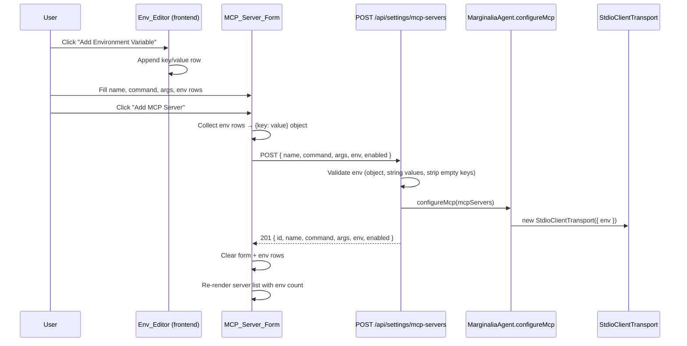

# Design Document: MCP Environment Variables

## Overview

This feature closes the gap between the backend's existing `MCPServerConfig.env` support and the frontend settings UI, which currently hardcodes `env: {}` when adding MCP servers. The change spans three layers:

1. **Frontend** — Add an `Env_Editor` key-value widget to the MCP server add form, and display env var counts in the server list.
2. **Backend validation** — Strengthen the `POST /api/settings/mcp-servers` route to validate the `env` field (plain object, string values, strip empty keys).
3. **Transport wiring** — Already implemented in `agent.ts` (`StdioClientTransport` receives `c.env` when non-empty). No changes needed here, but the design documents the contract for completeness.

The scope is intentionally narrow: add/display env vars on creation. Editing existing servers is out of scope.

## Architecture



No new backend files are introduced. Changes touch:

| File | Change |
|---|---|
| `frontend/index.html` | Add env row container + "Add Environment Variable" button inside the MCP form |
| `frontend/app.js` | `addMcpServer()` collects env rows; `renderMcpServerList()` shows env count |
| `src/routes.ts` | Validate `env` field in `POST /api/settings/mcp-servers` handler |

`src/models.ts`, `src/agent.ts` — no changes needed (already support `env: Record<string, string>`).

## Components and Interfaces

### Frontend: Env_Editor Widget

The Env_Editor is a set of DOM manipulation functions, not a class. It lives inside `frontend/app.js` alongside the existing MCP form logic.

**Functions:**

- `addEnvRow()` — Appends a new key/value input row to `#mcp-env-rows`. Each row contains:
  - `<input type="text" placeholder="KEY">` (class `env-key`)
  - `<input type="text" placeholder="Value">` (class `env-value`)
  - `<button>` remove button (×)
- `collectEnvVars()` → `Record<string, string>` — Iterates all `.env-row` elements, reads key/value inputs, skips rows where key is empty, and for duplicate keys uses the last value.
- `clearEnvRows()` — Removes all `.env-row` elements from the container.

**DOM structure added to `index.html`:**

```html
<!-- Inside the MCP Servers .settings-add-form, after the args input -->
<div id="mcp-env-rows" aria-label="Environment variables"></div>
<button type="button" id="add-env-row-btn" class="env-add-btn">+ Add Environment Variable</button>
```

### Frontend: Server List Display

`renderMcpServerList()` is modified to append env var count text to the detail span when `Object.keys(srv.env).length > 0`. Format: `" · 2 env vars"` or `" · 1 env var"`.

### Backend: Env Validation in Routes

The existing `POST /api/settings/mcp-servers` handler in `routes.ts` already accepts `env` from the request body and does a loose check (`env && typeof env === "object" && !Array.isArray(env)`). The enhancement adds:

1. Validate every value in `env` is a string → 422 if not.
2. Strip entries where the key is an empty string (after trim).
3. Keep the existing fallback to `{}` when `env` is omitted.

This validation happens inline in the route handler, consistent with how `name` and `command` are validated today (no separate middleware).

## Data Models

No new types are introduced. The existing `MCPServerConfig` in `src/models.ts` already has the correct shape:

```typescript
interface MCPServerConfig {
  id: string;
  name: string;
  command: string;
  args: string[];
  env: Record<string, string>;  // ← already exists
  enabled: boolean;
}
```

The frontend state already stores `mcpServers` with the full shape returned by the API, so `env` will be available after the server responds with the created config.

The API request body shape for `POST /api/settings/mcp-servers` remains:

```json
{
  "name": "string",
  "command": "string",
  "args": ["string"],
  "env": { "KEY": "value" },
  "enabled": true
}
```


## Correctness Properties

*A property is a characteristic or behavior that should hold true across all valid executions of a system — essentially, a formal statement about what the system should do. Properties serve as the bridge between human-readable specifications and machine-verifiable correctness guarantees.*

### Property 1: Env collection produces correct object from key-value rows

*For any* list of key-value pairs (where keys and values are arbitrary strings), `collectEnvVars` should produce an object that:
- Contains only entries whose key is non-empty (after trimming),
- For duplicate keys, uses the value from the last occurrence in the list.

**Validates: Requirements 1.5, 1.6**

### Property 2: Env count display matches actual env object size

*For any* MCP server configuration with an `env` object of size N, the rendered list item should contain the text `"N env var"` (singular or plural) when N > 0, and should not contain any env var indicator when N === 0.

**Validates: Requirements 2.1, 2.2**

### Property 3: Invalid env payloads are rejected with 422

*For any* request body where the `env` field is present but is not a plain object with all-string values (e.g., arrays, null, numbers, or objects containing non-string values), the `POST /api/settings/mcp-servers` endpoint should respond with HTTP 422 and the `mcpServers` config array should remain unchanged.

**Validates: Requirements 3.1, 3.2, 3.5**

### Property 4: Empty keys are stripped from stored env

*For any* valid env object (plain object with string values) that contains entries with empty-string keys, the stored `MCPServerConfig.env` should exclude those entries while preserving all entries with non-empty keys.

**Validates: Requirements 3.3**

## Error Handling

| Scenario | Behavior |
|---|---|
| `env` is not a plain object (array, null, number, string) | 422 with `"env must be a plain object"` |
| `env` contains a non-string value | 422 with `"All env values must be strings"` |
| `env` contains empty-string keys | Silently stripped; server still created with remaining entries |
| `env` omitted entirely | Defaults to `{}` (existing behavior, unchanged) |
| MCP server process fails to start with provided env | Best-effort — server config is still saved (existing `configureMcp` error handling) |
| Frontend: user submits form with no env rows | `env: {}` sent to API (same as current behavior) |

No new error types or error classes are introduced. Validation errors use the existing pattern of inline `res.status(422).json({ error: "..." })` in the route handler.

## Testing Strategy

### Unit Tests (Vitest)

- Verify the route handler rejects invalid `env` shapes (array, null, non-string values) with 422.
- Verify the route handler strips empty-string keys from `env`.
- Verify the route handler defaults `env` to `{}` when omitted.
- Verify `renderMcpServerList` output includes env count text for servers with env vars.
- Verify `renderMcpServerList` output omits env indicator for servers with empty env.

### Property-Based Tests (Vitest + fast-check)

Each correctness property above maps to a single property-based test. Tests live in `src/__tests__/` and use `fast-check` for input generation.

**Configuration:**
- Minimum 100 iterations per property test.
- Each test is tagged with a comment referencing the design property.

**Property test plan:**

1. **Feature: mcp-env-variables, Property 1: Env collection produces correct object from key-value rows**
   - Generator: `fc.array(fc.tuple(fc.string(), fc.string()))` — list of (key, value) pairs.
   - Assertion: Result object contains only non-empty-key entries; for duplicates, last value wins.

2. **Feature: mcp-env-variables, Property 2: Env count display matches actual env object size**
   - Generator: `fc.dictionary(fc.string({minLength: 1}), fc.string())` — random env objects.
   - Assertion: Rendered detail text contains correct count (or no indicator for empty).

3. **Feature: mcp-env-variables, Property 3: Invalid env payloads are rejected with 422**
   - Generator: `fc.oneof(fc.array(...), fc.constant(null), fc.integer(), fc.string(), fc.dictionary(fc.string(), fc.oneof(fc.integer(), fc.boolean(), fc.constant(null))))` — various invalid env shapes.
   - Assertion: Route handler responds 422; `config.mcpServers` length unchanged.

4. **Feature: mcp-env-variables, Property 4: Empty keys are stripped from stored env**
   - Generator: `fc.dictionary(fc.oneof(fc.constant(""), fc.string()), fc.string())` — env objects with some empty keys.
   - Assertion: Stored env has no empty-string keys; all non-empty-key entries preserved.

### Testing Library

- **Property-based testing**: `fast-check` (already a project dependency)
- **Test runner**: `vitest` (already configured)
- Tests follow existing patterns in `src/__tests__/routes.test.ts` for route handler testing (mock request/response objects, `extractHandler` utility).
