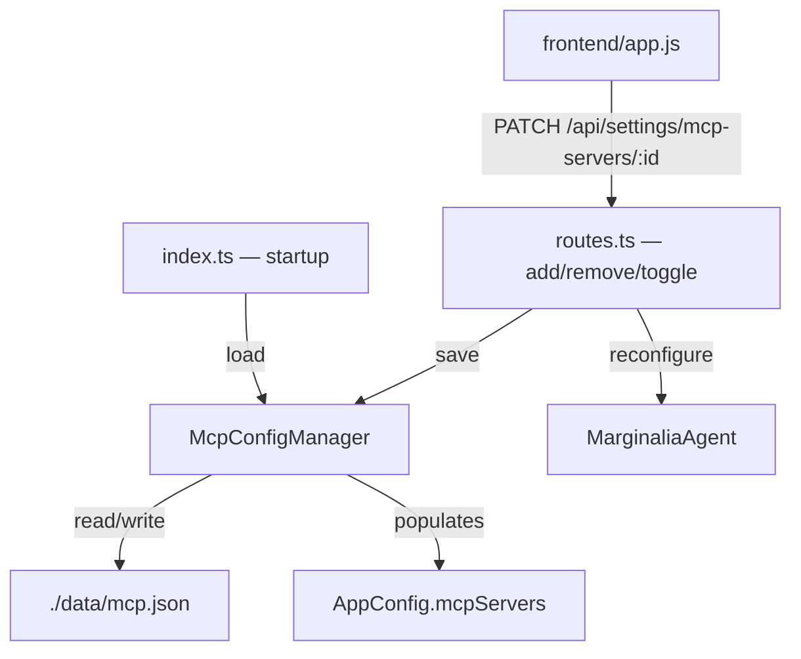

# Design Document: MCP Persistent Configuration

## Overview

This feature adds persistent storage for MCP server configurations using a `./data/mcp.json` file. Currently, MCP server configs live only in the in-memory `AppConfig.mcpServers` array and are lost on every restart. After this change, the file becomes the source of truth on startup, and every mutation (add, remove, toggle) writes the full state back to disk.

The file format follows the VS Code / Cursor / Kiro convention: a top-level `mcpServers` map keyed by server name. The feature also introduces an enable/disable toggle for individual MCP servers, exposed via a new `PATCH /api/settings/mcp-servers/:id` endpoint and a toggle control in the settings UI.

## Architecture

The design introduces a single new module — `McpConfigManager` — that owns all file I/O for `mcp.json`. It sits between `index.ts` (startup) and `routes.ts` (mutations), following the same dependency-injection pattern used by `ConversationLibrary`.



### Key Design Decisions

1. **Single new module, not extending PersistenceAdapter**: `JsonFilePersistenceAdapter` is purpose-built for conversations (per-entity files, load/list/delete). MCP config is a single file with a different shape. A dedicated `McpConfigManager` class is simpler and avoids polluting the conversation persistence interface.

2. **File as startup source of truth, memory as runtime source of truth**: On startup, the file seeds `AppConfig.mcpServers`. After that, all reads come from memory and all mutations write-through to disk. There is no file-watching or hot-reload — the file is only read once at startup.

3. **Atomic writes via temp-file + rename**: To prevent corruption from partial writes (e.g., crash mid-write), the manager writes to a `.tmp` file then renames it. This is the standard pattern for atomic file updates on POSIX and Windows (within the same filesystem).

4. **Best-effort persistence**: If a file write fails, the error is logged but the API request succeeds. The in-memory state is always authoritative at runtime. This matches the existing fire-and-forget persistence pattern used for conversations.

5. **VS Code-compatible file format**: The file uses a `mcpServers` map keyed by server name (not an array), making it easy to hand-edit or copy from other tools. The `id` field is generated at load time and not stored in the file.

## Components and Interfaces

### McpConfigManager

New file: `src/mcp-config-manager.ts`

```typescript
export interface McpConfigFileEntry {
  command: string;
  args?: string[];
  env?: Record<string, string>;
  enabled?: boolean;
}

export interface McpConfigFile {
  mcpServers: Record<string, McpConfigFileEntry>;
}

export class McpConfigManager {
  constructor(private readonly filePath: string = "./data/mcp.json");

  /** Read and validate mcp.json, returning MCPServerConfig[]. Returns [] on missing/invalid file. */
  async load(): Promise<MCPServerConfig[]>;

  /** Write the full MCPServerConfig[] to mcp.json atomically. */
  async save(servers: MCPServerConfig[]): Promise<void>;
}
```

**load()** flow:
1. Read file. If ENOENT → return `[]`.
2. Parse JSON. If invalid → log warning, return `[]`.
3. Validate `mcpServers` is an object. If not → log warning, return `[]`.
4. For each entry: validate `command` is a non-empty string. Skip invalid entries with a warning.
5. Coerce optional fields: `args` defaults to `[]`, `env` defaults to `{}`, `enabled` defaults to `true`.
6. Generate a UUID `id` for each entry.
7. Return the array of `MCPServerConfig`.

**save()** flow:
1. Convert `MCPServerConfig[]` back to the `McpConfigFile` format (map keyed by name).
2. Serialize with 2-space indentation.
3. Write to `{filePath}.tmp`.
4. Rename `{filePath}.tmp` → `{filePath}`.
5. On error → log warning, do not throw.

### PATCH Endpoint

New route in `routes.ts`:

```
PATCH /api/settings/mcp-servers/:id
Body: { "enabled": boolean }
Response: MCPServerConfig (the updated server object)
```

Validation:
- `enabled` must be a boolean → 422
- Server ID must exist → 404

Side effects:
- Updates `config.mcpServers[i].enabled`
- Calls `agent.configureMcp(config.mcpServers)` to reconnect only enabled servers
- Calls `mcpConfigManager.save(config.mcpServers)` (fire-and-forget)

### Updated Startup Sequence (index.ts)

```typescript
const mcpConfigManager = new McpConfigManager();
const servers = await mcpConfigManager.load();
config.mcpServers = servers;

// ... create store, agent, library, titleGenerator ...

if (servers.some(s => s.enabled)) {
  await agent.configureMcp(config.mcpServers);
}

const router = createRouter({ store, agent, config, library, titleGenerator, mcpConfigManager });
```

`McpConfigManager` is injected into `createRouter` so routes can call `save()` after mutations.

### Updated RouterDeps

```typescript
interface RouterDeps {
  store: ConversationStore;
  agent: MarginaliaAgent;
  config: AppConfig;
  library: ConversationLibrary;
  titleGenerator: TitleGenerator;
  mcpConfigManager: McpConfigManager;
}
```

### Frontend Changes (app.js)

The `renderMcpServerList()` function is updated to include a toggle switch for each server:

```
[toggle] ServerName    command args · N env vars    [Remove]
```

- Toggle sends `PATCH /api/settings/mcp-servers/:id` with `{ enabled: !current }`.
- Disabled servers render with reduced opacity (`opacity: 0.5`).
- No page reload required — the toggle updates state and re-renders the list.

### Existing Endpoints Updated

The existing `POST /api/settings/mcp-servers` (add) and `DELETE /api/settings/mcp-servers/:id` (remove) routes gain a `mcpConfigManager.save(config.mcpServers)` call after mutating the in-memory array. The save is fire-and-forget (`.catch(err => console.error(...))`).

## Data Models

### File Format (`./data/mcp.json`)

```json
{
  "mcpServers": {
    "my-server": {
      "command": "npx",
      "args": ["-y", "@some/mcp-server"],
      "env": {
        "API_KEY": "sk-..."
      },
      "enabled": true
    },
    "another-server": {
      "command": "node",
      "args": ["./local-server.js"],
      "env": {},
      "enabled": false
    }
  }
}
```

### In-Memory Model (unchanged)

The existing `MCPServerConfig` in `models.ts` already has all needed fields:

```typescript
export interface MCPServerConfig {
  id: string;       // Generated at load time, not persisted in file
  name: string;     // Derived from the map key
  command: string;
  args: string[];
  env: Record<string, string>;
  enabled: boolean;
}
```

### Mapping Between File and Memory

| File (map entry)       | MCPServerConfig field |
|------------------------|-----------------------|
| map key                | `name`                |
| (generated)            | `id`                  |
| `command`              | `command`             |
| `args` (default `[]`)  | `args`                |
| `env` (default `{}`)   | `env`                 |
| `enabled` (default `true`) | `enabled`         |

When saving back to file, the `id` field is dropped and the `name` becomes the map key.


## Correctness Properties

*A property is a characteristic or behavior that should hold true across all valid executions of a system — essentially, a formal statement about what the system should do. Properties serve as the bridge between human-readable specifications and machine-verifiable correctness guarantees.*

### Property 1: Configuration round-trip

*For any* array of valid `MCPServerConfig` objects, saving them via `McpConfigManager.save()` and then loading via `McpConfigManager.load()` should produce an equivalent array — same names, commands, args, env maps, and enabled flags (ids are regenerated on load, so they are excluded from comparison).

**Validates: Requirements 1.2, 2.1, 2.2, 3.1, 3.2, 3.3, 7.2**

### Property 2: Loaded entries have unique IDs

*For any* valid `mcp.json` file containing N server entries, loading via `McpConfigManager.load()` should produce N entries each with a non-empty `id`, and all IDs should be distinct.

**Validates: Requirements 2.3**

### Property 3: Invalid entries are skipped, optional fields get defaults

*For any* `mcp.json` file containing a mix of valid entries and entries missing the required `command` field, `McpConfigManager.load()` should return only the valid entries. Furthermore, for valid entries missing optional fields (`args`, `env`, `enabled`), the loaded config should have `args` as `[]`, `env` as `{}`, and `enabled` as `true`.

**Validates: Requirements 6.1, 6.4**

### Property 4: Extra fields are ignored

*For any* valid `mcp.json` file, adding arbitrary extra fields to server entries should not change the loaded result (same name, command, args, env, enabled values).

**Validates: Requirements 6.3**

### Property 5: PATCH toggle updates enabled state

*For any* MCP server in the config and *for any* boolean value, sending a PATCH request with `{ "enabled": value }` should return the server object with its `enabled` field set to that value, and the in-memory config should reflect the change.

**Validates: Requirements 4.3, 5.4**

### Property 6: PATCH rejects non-boolean enabled values

*For any* value that is not a boolean (string, number, null, object, array), sending a PATCH request with `{ "enabled": value }` should return HTTP 422.

**Validates: Requirements 5.2**

### Property 7: PATCH returns 404 for non-existent server ID

*For any* UUID that does not match any server in the config, sending a PATCH request should return HTTP 404.

**Validates: Requirements 5.3**

## Error Handling

| Scenario | Behavior |
|---|---|
| `mcp.json` does not exist on startup | `load()` returns `[]`, app starts normally |
| `mcp.json` contains invalid JSON | `load()` logs warning, returns `[]`, app starts normally |
| `mcp.json` entry missing `command` | Entry skipped, warning logged, other entries loaded |
| `mcp.json` entry has wrong field types | Entry coerced where possible (e.g., `args` string → skip), or skipped with warning |
| File write fails (disk full, permissions) | Error logged via `console.error`, API request succeeds with in-memory state |
| Atomic rename fails | Falls back to direct write, logs warning |
| PATCH with non-boolean `enabled` | HTTP 422 with `{ "error": "enabled must be a boolean" }` |
| PATCH with non-existent server ID | HTTP 404 with `{ "error": "MCP server config not found" }` |

All error paths follow the existing pattern: log and continue. The application never crashes or fails an API request due to file I/O errors.

## Testing Strategy

### Property-Based Tests (fast-check)

Each correctness property maps to a single property-based test with a minimum of 100 iterations. Tests target the `McpConfigManager` class directly (using temp directories) and the PATCH endpoint (using the router with injected dependencies).

**Library**: `fast-check` (already in use)
**Runner**: `vitest`
**Test file**: `src/__tests__/mcp-config-manager.test.ts`

Each test is tagged with a comment referencing its design property:
```
// Feature: mcp-persistent-config, Property 1: Configuration round-trip
```

Property tests focus on:
- Round-trip serialization of `McpConfigManager` (Property 1)
- ID uniqueness on load (Property 2)
- Validation and defaults (Property 3)
- Extra field tolerance (Property 4)
- PATCH endpoint behavior (Properties 5, 6, 7)

### Unit Tests

Unit tests complement property tests for specific examples and edge cases:
- Loading from a non-existent file returns `[]`
- Loading invalid JSON returns `[]`
- 2-space indentation in saved files
- Atomic write uses temp file + rename
- PATCH endpoint integration (specific example with known server)
- Frontend toggle sends correct PATCH request (manual verification)

### Generators

The following fast-check generators are needed:

- `arbMcpServerConfig`: generates valid `MCPServerConfig` objects with random names, commands, args, env, and enabled flags
- `arbMcpConfigFile`: generates valid `McpConfigFile` JSON objects (map of name → entry)
- `arbMcpConfigFileWithInvalid`: generates files with a mix of valid and invalid entries (missing command, wrong types)
- `arbNonBoolean`: generates values that are not booleans (strings, numbers, null, objects, arrays)
