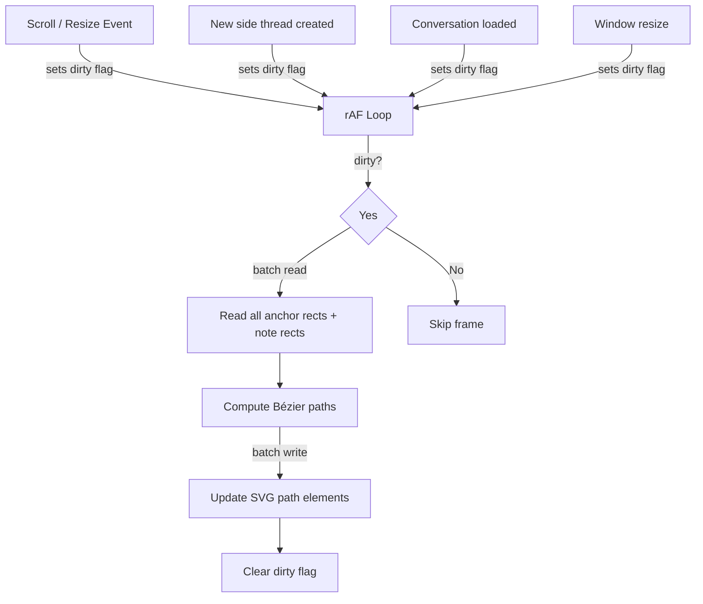

# Design Document: Smooth Connector Lines

## Overview

This design replaces the current straight dashed SVG `<line>` connector lines between anchor highlights and margin note cards with smooth S-curve cubic Bézier `<path>` elements. It also replaces the debounced `setTimeout`-based scroll update mechanism with a `requestAnimationFrame`-based loop that updates connector positions every frame during scrolling, resizing, or any layout change.

The change is entirely frontend-side, modifying only `frontend/app.js` and `frontend/index.html`. No backend changes are needed. No external libraries are required — SVG cubic Bézier paths and `requestAnimationFrame` are native browser APIs.

### Design Decisions

1. **No external library**: SVG `<path>` with cubic Bézier (`C` command) is sufficient. Adding a library like D3 or anime.js would be overkill for static curve computation.
2. **`requestAnimationFrame` loop with dirty flag**: Rather than attaching rAF directly to every scroll event (which can fire faster than frame rate), we use a dirty-flag pattern. Scroll/resize listeners set a flag, and a single persistent rAF loop checks the flag each frame and redraws only when needed.
3. **DOM element reuse**: Instead of `innerHTML = ""` on every redraw, we maintain a pool of `<path>` elements keyed by thread ID. Paths are updated in place, added when new, and removed when stale. This avoids GC pressure and DOM churn.
4. **Read-then-write batching**: All `getBoundingClientRect()` calls are batched before any SVG attribute mutations, preventing layout thrashing.
5. **Visibility culling**: Connectors for off-screen anchor-note pairs are hidden via `display: none` rather than removed, so they can be instantly restored when scrolled back into view.

## Architecture



### Data Flow

1. **Event sources** (scroll on main panel, scroll on margin panel, window resize, new side thread, conversation load) all set a shared `connectorsDirty` flag to `true`.
2. A persistent `requestAnimationFrame` loop runs for the lifetime of the page. Each frame, it checks the flag.
3. When dirty, it performs a single batch read of all DOM positions, computes Bézier curves, and batch-writes SVG path attributes.
4. The flag is cleared after the write pass.

## Components and Interfaces

### ConnectorRenderer (module within app.js)

Since the app uses vanilla JS with no build step, the connector renderer is implemented as a set of functions and state variables within `app.js`, replacing the existing `drawAnchorConnectors` function and its debounced event listeners.

#### State

```javascript
/** Map of threadId → SVG <path> element for reuse */
const connectorPaths = new Map();

/** Dirty flag — set by event listeners, cleared after redraw */
let connectorsDirty = true;

/** rAF handle for cleanup if needed */
let connectorRafId = null;
```

#### Functions

| Function | Signature | Description |
|---|---|---|
| `computeBezierPath` | `(x1, y1, x2, y2) → string` | Computes an SVG path `d` attribute string for a cubic Bézier S-curve between two points |
| `updateConnectors` | `() → void` | Batch-reads DOM positions, computes paths, batch-writes SVG attributes. Handles element reuse and visibility culling. |
| `connectorLoop` | `() → void` | The rAF loop function. Checks dirty flag, calls `updateConnectors` if dirty, requests next frame. |
| `markConnectorsDirty` | `() → void` | Sets `connectorsDirty = true`. Used as the event listener callback. |
| `startConnectorLoop` | `() → void` | Starts the rAF loop. Called once on page load. |

#### Bézier Curve Computation

The S-curve is a cubic Bézier with two control points offset horizontally from the start and end points:

```
M x1,y1 C cx1,y1 cx2,y2 x2,y2
```

Where:
- `(x1, y1)` = right edge midpoint of anchor highlight (start)
- `(x2, y2)` = left edge of margin note header (end)
- `cx1 = x1 + offset` (control point 1, pulled right from start)
- `cx2 = x2 - offset` (control point 2, pulled left from end)
- `offset = (x2 - x1) * 0.4` (40% of horizontal distance, clamped to a minimum of 30px)

This produces a smooth S-shape that works well regardless of the vertical relationship between anchor and note. When both points are at the same Y, the curve still bows outward horizontally rather than collapsing to a straight line, because the control points are always offset.

### CSS Changes (index.html)

The existing CSS rule targeting `#anchor-connector-svg line` needs to be updated to target `#anchor-connector-svg path` instead:

```css
#anchor-connector-svg path {
  fill: none;
  stroke: var(--color-primary);
  stroke-width: 2.5;
  stroke-dasharray: 6 4;
  opacity: 0.6;
}
```

The `fill: none` is critical — without it, the Bézier path would fill the enclosed area with black.

### Integration Points

The following existing call sites in `app.js` that currently call `drawAnchorConnectors()` will be replaced with `markConnectorsDirty()`:

1. `loadConversation()` — after rendering all side threads
2. `submitSideQuestion()` SSE `done` handler — after new margin note is rendered
3. `submitSideFollowup()` SSE `done` handler — after follow-up is rendered

The debounced scroll/resize event listeners will be replaced:

```javascript
// OLD
mainPanel.addEventListener("scroll", debounce(drawAnchorConnectors, 50));
marginNotePanel.addEventListener("scroll", debounce(drawAnchorConnectors, 50));
window.addEventListener("resize", debounce(drawAnchorConnectors, 100));

// NEW
mainPanel.addEventListener("scroll", markConnectorsDirty, { passive: true });
marginNotePanel.addEventListener("scroll", markConnectorsDirty, { passive: true });
window.addEventListener("resize", markConnectorsDirty);
```

The `{ passive: true }` option on scroll listeners tells the browser we won't call `preventDefault()`, enabling scroll performance optimizations.

## Data Models

No new data models are introduced. The existing `state.conversation.sideThreads` array (with each thread's `anchor.messageId`, `anchor.startOffset`, `anchor.endOffset`) provides all the data needed to compute connector endpoints.

The only new runtime state is:
- `connectorPaths: Map<string, SVGPathElement>` — maps thread IDs to their reusable SVG path elements
- `connectorsDirty: boolean` — the dirty flag for the rAF loop
- `connectorRafId: number | null` — the rAF handle


## Correctness Properties

*A property is a characteristic or behavior that should hold true across all valid executions of a system — essentially, a formal statement about what the system should do. Properties serve as the bridge between human-readable specifications and machine-verifiable correctness guarantees.*

### Property 1: Bézier path is well-formed with correct control point geometry

*For any* two points `(x1, y1)` and `(x2, y2)` where `x2 > x1` (anchor is left of note), `computeBezierPath(x1, y1, x2, y2)` should return a string matching the SVG cubic Bézier format `M <x1>,<y1> C <cx1>,<cy1> <cx2>,<cy2> <x2>,<y2>` where the first control point's x-coordinate `cx1 > x1` and the second control point's x-coordinate `cx2 < x2` (i.e., control points are horizontally offset inward to produce the S-shape).

**Validates: Requirements 1.1, 1.2**

### Property 2: Same-Y inputs still produce a non-degenerate curve

*For any* two points `(x1, y)` and `(x2, y)` at the same vertical position where `x2 > x1`, `computeBezierPath(x1, y, x2, y)` should produce control points where `cx1 !== x1` and `cx2 !== x2`, ensuring the path does not degenerate into a straight horizontal line.

**Validates: Requirements 1.3**

### Property 3: Connector visibility matches viewport membership

*For any* connector with an anchor rect and a note rect, the connector path should be visible (not `display: none`) if and only if the anchor rect intersects the main panel's visible viewport AND the note rect intersects the margin panel's visible viewport. If either endpoint is fully outside its panel's viewport, the connector should be hidden.

**Validates: Requirements 5.1, 5.2, 5.3**

### Property 4: SVG path elements are reused across redraws

*For any* set of thread IDs, calling `updateConnectors` twice with the same set of threads should result in the same `<path>` DOM element references in the `connectorPaths` map — elements should be updated in place, not recreated.

**Validates: Requirements 3.4**

### Property 5: One connector per valid side thread

*For any* set of side threads where each thread has a valid anchor highlight in the main panel and a corresponding margin note card in the margin panel, the number of `<path>` elements in the connector SVG should equal the number of such valid threads.

**Validates: Requirements 6.1**

## Error Handling

This feature is purely visual and non-critical — connector line failures should never break the application.

| Scenario | Handling |
|---|---|
| Anchor text node not found (e.g., DOM changed between frames) | Skip that connector silently; it will be retried next frame |
| Margin note element missing for a thread | Skip that connector; no path created |
| `getBoundingClientRect()` returns zero-size rect | Skip that connector (anchor may be in a collapsed/hidden element) |
| SVG `setAttribute` throws (shouldn't happen, but defensive) | Wrap the write pass in try/catch per connector; log to console, continue with remaining connectors |
| `requestAnimationFrame` not available (very old browser) | Fall back to the existing debounced `setTimeout` approach |

The general principle: each connector is independent. A failure computing or rendering one connector should not prevent the others from rendering.

## Testing Strategy

### Testing Approach

This feature has a pure computational core (`computeBezierPath`) that is highly amenable to property-based testing, plus DOM integration logic that requires example-based unit tests with mocked DOM elements.

The existing test infrastructure uses **Vitest** with **fast-check** for property-based testing. Tests live in `src/__tests__/`. Since the connector logic lives in `frontend/app.js` (vanilla JS, no module system), the testable pure functions (`computeBezierPath`, visibility logic) will be extracted into a separate file `frontend/connector-math.js` that exports functions usable by both `app.js` and the test suite.

Alternatively, since the project already uses Vitest with Node environment, we can create a thin TypeScript wrapper in `src/__tests__/` that re-implements or imports the pure math functions for testing. The actual `app.js` functions serve as the source of truth; the tests validate the algorithm independently.

### Property-Based Tests (fast-check)

Each correctness property maps to a single property-based test with a minimum of 100 iterations:

| Test | Property | Iterations |
|---|---|---|
| Bézier path format and control point geometry | Property 1 | 100 |
| Same-Y non-degenerate curve | Property 2 (edge case of Property 1) | 100 |
| Visibility ↔ viewport membership | Property 3 | 100 |
| Element reuse across redraws | Property 4 | 100 |
| Connector count matches valid thread count | Property 5 | 100 |

Each test must be tagged with a comment:
```
// Feature: smooth-connector-lines, Property N: <property text>
```

### Unit Tests (example-based)

- Specific coordinate examples for `computeBezierPath` (e.g., horizontal line, steep diagonal, very close points)
- Dirty flag is set by `markConnectorsDirty()`
- Integration: scroll event → dirty flag → rAF loop calls `updateConnectors`
- Resize event → dirty flag set
- New side thread creation → `markConnectorsDirty` called
- Conversation load → `markConnectorsDirty` called

### What NOT to Test

- Actual rAF timing or frame rate (browser runtime concern)
- CSS styling (visual, not functional)
- Performance under load (requires real browser profiling)
